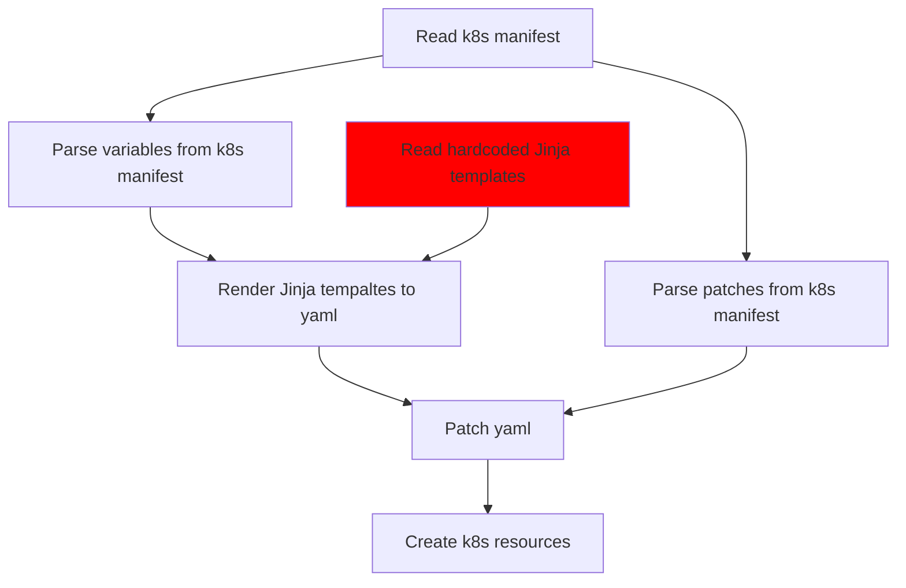

- Start Date: 22-03-2022
- Status: Proposed

# Native Rstudio Sessions

## Summary

Enable Amalthea to support native Rstudio sessions without relying on jupyterlab.
In order to tackle this problem this proposal also tries to make Amalthea even more
general and adaptable so that in the future we can accomodate similar "native" sessions
if the need arises.

## Motivation

The reason for this is that a large portion of Renku users are actually R users.
As such they rely on our R images and Rstudio. But these images include all of the 
regular stuff that a python/jupyterlab image contains in addition to R and Rstudio.
Therefore these images have a problems:
- they take long to build
- they are large
- they are a bit hard to maintain because you have to setup all of the jupyter-rstudio
proxying and make sure that works

## Design Detail

Amalthea (and by extension the notebook service) should support native Rstudio sessions.

Requirements for this feature are:
- Have one k8s resource for both Jupyter and Rstudio sessions. Relying on a different CRD
for each session type is not feasible because: (1) the notebook service has to do extra 
work to merge responses from multiple calls to the k8s API, (2) the performance of the notebook
service degrades the more calls it has to make.
- Enable Amalthea / notebook service to accomodate other types of "custom"/"native" sessions
that may (and will) come up in the future. For now we only have a need for Rstudio-native sessions
but it is very likely in the future a different type of sessions may be needed.

### Current workflow for sessions in Amalthea



There are a lot of assumptions that we "bake into" the hardcoded Jinja templates.
Then further in the Amalthea code we further reinforce and rely on these.

### More flexibility

Add a field in the CRD that defines a set of templates that are used. Here the user
can pick between Jupyterlab or Rstudio. The current Jupyterserver templates can be one of many that are used. Any assumptions or strong decisions made about a specific session's structure, organization, etc. Can be made in these Jupyter or R-specific templates.


### Current assumptions hardcoded in Amalthea Jinja templates
- Session is a statefulset, contains session container and authentication proxy
- Session container listens on port 8888
- Authentication proxy listens on port 4180
- Service points to authentication proxy (4180)
- Ingress points to service which leads only to authentication proxy
- Secrets for Jupyterlab and authentication
- Configmap for Jupyterlab config (mounted in session container)
- PVC for session storage

### Some of these assumptions will remain hardcoded
- PVC/Storage: expect the user to patch in volume mount
- Ingress: keep as is; point service to auth proxy
- Authentication: keep as is; port 4180 is the only entry and it goes through the auth proxy

### Current manifest

```yaml
spec:
  culling:
    idleSecondsThreshold: 0
    maxAgeSecondsThreshold: 0
  auth:
    oidc:
      authorizedEmails:
      - <user-email>
      authorizedGroups: []
      clientId: OidcClientName
      clientSecret:
        value: OidcSecretValue
      enabled: true
      issuerUrl: https://dev.renku.ch/auth/realms/Renku
    token: ""
  jupyterServer:
    defaultUrl:
    image:
    resources:
    rootDir: /home/jovyanl/work/<project_name>
  routing:
    host: dev.renku.ch
    ingressAnnotations:
      kubernetes.io/ingress.class: nginx
      nginx.ingress.kubernetes.io/proxy-body-size: "0"
      nginx.ingress.kubernetes.io/proxy-buffer-size: 8k
      nginx.ingress.kubernetes.io/proxy-request-buffering: "off"
    path: /sessions/<session_name>
    tls:
      enabled: true
      secretName: dev-renku-ch-tls
  storage:
    pvc:
      enabled:
      mountPath: /home/jovyanl/work
      storageClassName:
    size:
```

### Proposed revised manifest

```yaml
spec:
  type: jupyterlab # NEW
  culling:
    idleSecondsThreshold: 0
    maxAgeSecondsThreshold: 0
  auth:
    oidc:
      authorizedEmails:
      - <user-email>
      authorizedGroups: []
      clientId: OidcClientName
      clientSecret:
        value: OidcSecretValue
      enabled: true
      issuerUrl: https://<oidc-server>
    token: ""
  server:
    defaultUrl:
    image:
    resources:
    rootDir: /home/jovyan
  routing:
    host: dev.renku.ch
    ingressAnnotations:
      kubernetes.io/ingress.class: nginx
      nginx.ingress.kubernetes.io/proxy-body-size: "0"
      nginx.ingress.kubernetes.io/proxy-buffer-size: 8k
      nginx.ingress.kubernetes.io/proxy-request-buffering: "off"
    path: /sessions/<session_name>
    tls:
      enabled: true
      secretName: tls-secret
  storage:
    pvc:
      enabled:
      mountPath: /home/jovyan
      storageClassName:
    size:
```

## Drawbacks

We can decide to not do this because currently Rstudio sessions work well. And yes our images
for Rstudio are big and bloated but they work. Changing things introduces the risk of bugs and
requires more effort.

However I believe that the payoff from enable native Rstudio sessions and even more importantly
from making Amalthea and the notebook service more general is worth it.
