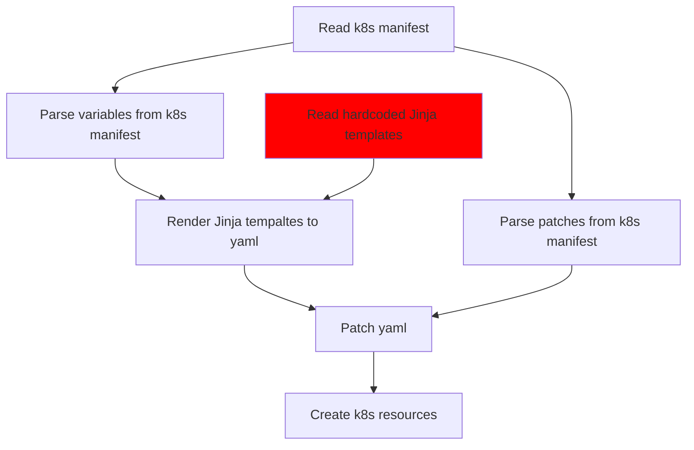
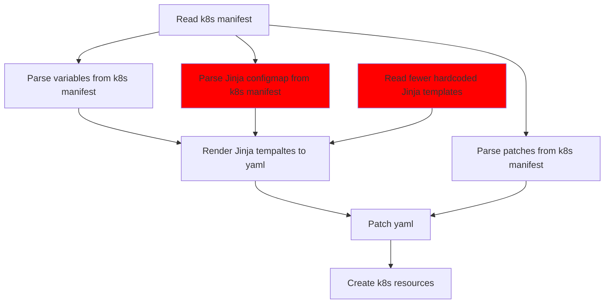
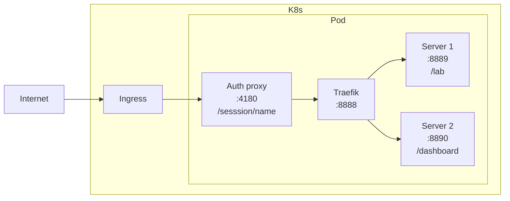

- Start Date: 22-03-2022
- Status: Proposed

# Native Rstudio Sessions

## Summary

Enable Amalthea to support native Rstudio sessions without relying on jupyterlab.
In order to tackle this problem this proposal also tries to make Amalthea even more
general and adaptable so that in the future we can accomodate similar "native" sessions
if the need arises.

## Motivation

The reason for this is that a large portion of Renku users are actually R users.
As such they rely on our R images and Rstudio. But these images include all of the 
regular stuff that a python/jupyterlab image contains in addition to R and Rstudio.
Therefore these images have a problems:
- they take long to build
- they are large
- they are a bit hard to maintain because you have to setup all of the jupyter-rstudio
proxying and make sure that works

## Design Detail

Amalthea (and by extension the notebook service) should support native Rstudio sessions.

Requirements for this feature are:
- Have one k8s resource for both Jupyter and Rstudio sessions. Relying on a different CRD
for each session type is not feasible because: (1) the notebook service has to do extra 
work to merge responses from multiple calls to the k8s API, (2) the performance of the notebook
service degrades the more calls it has to make.
- Enable Amalthea / notebook service to accomodate other types of "custom"/"native" sessions
that may (and will) come up in the future. For now we only have a need for Rstudio-native sessions
but it is very likely in the future a different type of sessions may be needed.

### Current workflow for sessions in Amalthea



There are a lot of assumptions that we "bake into" the hardcoded Jinja templates.
Then further in the Amalthea code we further reinforce and rely on these.

### More flexibility

Make the "base Jinja templates" be a resource in k8s that users add. The current
Jupyterserver templates can be one of many that are used. Any assumptions or strong decisions
made about structure, organization, etc. Can be made there.



### Current assumptions hardcoded in Amalthea Jinja templates
- Session is a statefulset, contains session container and authentication proxy
- Session container listens on port 8888
- Authentication proxy listens on port 4180
- Service points to authentication proxy (4180)
- Ingress points to service which leads only to authentication proxy
- Secrets for Jupyterlab and authentication
- Configmap for Jupyterlab config (mounted in session container)
- PVC for session storage

### Some of these assumptions will remain hardcoded
- PVC/Storage, but expect the user to patch in volume mount
- Ingress, keep as is point service to auth proxy
- Authentication, keep as is port 4180 is only entry and it goes through the auth proxy

### Why not move everything to configmaps and make zero assumptions?
- Then the Amalthea manifest is useless. The spec for amalthea just needs one field that points to a configmap that is then rendered and a list of patches.
- The manifest also is a way to "surface" useful information about the session. I.e. about resources, ingress,
storage, authentication.

### Current manifest

```yaml
spec:
  culling:
    idleSecondsThreshold: 0
    maxAgeSecondsThreshold: 0
  auth:
    oidc:
      authorizedEmails:
      - <user-email>
      authorizedGroups: []
      clientId: OidcClientName
      clientSecret:
        value: OidcSecretValue
      enabled: true
      issuerUrl: https://dev.renku.ch/auth/realms/Renku
    token: ""
  jupyterServer:
    defaultUrl:
    image:
    resources:
    rootDir: /home/jovyanl/work/<project_name>
  routing:
    host: dev.renku.ch
    ingressAnnotations:
      kubernetes.io/ingress.class: nginx
      nginx.ingress.kubernetes.io/proxy-body-size: "0"
      nginx.ingress.kubernetes.io/proxy-buffer-size: 8k
      nginx.ingress.kubernetes.io/proxy-request-buffering: "off"
    path: /sessions/<session_name>
    tls:
      enabled: true
      secretName: dev-renku-ch-tls
  storage:
    pvc:
      enabled:
      mountPath: /home/jovyanl/work
      storageClassName:
    size:
```

### Proposed revised manifest

```yaml
spec:
  template:
    configMap:
      name: jupyter-configmap
  culling:
    idleCheckEndpoint: http://jupyter-server/active
    idleSecondsThreshold: 0
    maxAgeSecondsThreshold: 0
  auth:
    oidc:
    token:
  server:
    containerName: jupyter-server
    image:
    resources:
      requests:
        memory: 1G
        cpu: 1
    ingress:
      - port: 8889
        url: /lab
      - port: 8890
        url: /active
      - port: 8891
        url: /dashboard
    storage:
      pvc:
        enabled: true
        storageClassName: cinder-csi
      size: 1G
      mountPath: /home/jovyan/work
    livenessProbe: {}
    readinessProbe: {}
    startupProbe: {}
  auxContainers:
    # same structure as server, but list
    # add option to mount main server storage as read only in a specific place
  routing:
    host: dev.renku.ch
    ingressAnnotations:
      kubernetes.io/ingress.class: nginx
      nginx.ingress.kubernetes.io/proxy-body-size: "0"
      nginx.ingress.kubernetes.io/proxy-buffer-size: 8k
      nginx.ingress.kubernetes.io/proxy-request-buffering: "off"
    path: /sessions/<session_name>
    tls:
      enabled: true
      secretName: dev-renku-ch-tls
```

### Ingress



### Anonymous sessions
Remove auth proxy, get Traefik to do simple token-based auth.

## Drawbacks

We can decide to not do this because currently Rstudio sessions work well. And yes our images
for Rstudio are big and bloated but they work. Changing things introduces the risk of bugs and
requires more effort.

However I believe that the payoff from enable native Rstudio sessions and even more importantly
from making Amalthea and the notebook service more general is worth it.

## Rationale and Alternatives

> Why is this design the best in the space of possible designs?

> What other designs have been considered and what is the rationale for not choosing them?

> What is the impact of not doing this?

## Unresolved questions

> What parts of the design do you expect to resolve through the RFC process before this gets merged?

> What parts of the design do you expect to resolve through the implementation of this feature before stabilisation?

> What related issues do you consider out of scope for this RFC that could be addressed in the future independently of the solution that comes out of this RFC?
