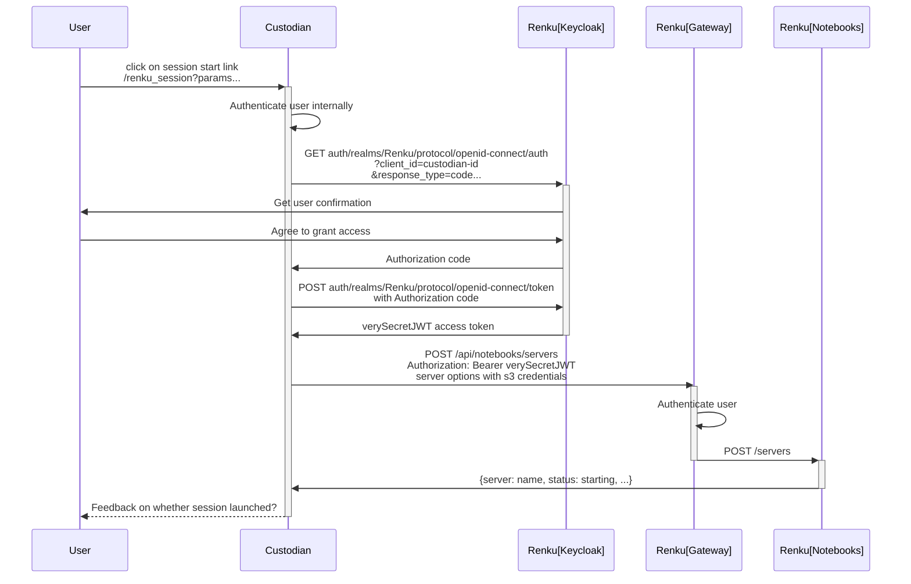

- Start Date: 2022-04-28
- Status: Draft

# Using Custodian to manage S3 credentials

This RFC is about how to interface with the Custodian for s3 credentials management
in the case of the Montreux Jazz Festival Archives project.

## Motivation

The project requires different users to have different access to data which will
be located in different S3 buckets, hosted by EPFL. Each S3 bucket comes with 2
sets of credentials - one for reading only and another for read/write.

Since these credentials cannot be easily changed the Custodian will be in charge
of managing (or inserting) the proper credentials for the specific user who is trying to
mount the data in their Renku session.

## Sequence flow

We can utilize an oauth flow so that the custodian can get authenticate with Renku on
behalf of the user. The diagram below assumes an authorization code flow between
Custodian and Renku. But variations of this flow can be considered/implemented.

The Custodian has to handle all the requests and responses that come from the User
or any other Renku components.

## Questions / Concerns

- The start link the user clicks to initiate all this has to include some credentials to
authenticate with the Custodian, or the cookies from the session should contain information
so that the custodian can detect and authenticate the user. 
- It would be nice if the user could get some kind of feedback from this process.
As it stands right now the user should just see the session "magically" appear in
the renku UI after they click the link.
