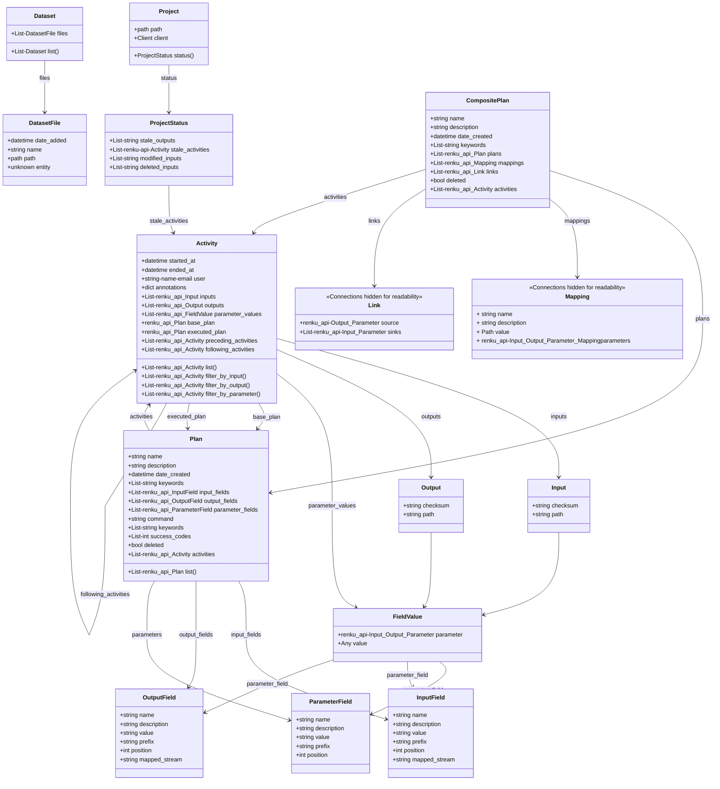

- Start Date: 23.03.2022
- Status: Proposed

# Using Plans and Activities through renku.api

## Summary

Add support for accessing Activities and Plans in the current project, along
with their child properties.

## Motivation

As users use more workflow features and more complex workflow pipelines, a way
for programatically seeing workflows in the current project becomes more
important.
Reading Activities and Plans allows meta-analysis in repositories, such as
summarizing over multiple executions of the same Plan.
Additionally, it allows writing scripts that detect existing workflows and
to then shell out to `renku workflow execute` to run Plans dynamically.


## Design Detail

Add new classes to `renku.api`:

- Activity
- InputField
- OutputField
- ParameterField
- Plan
- CompositePlan
- FieldValue
- Input
- Output
- Mapping
- Link

The classes wrap core renku classes and expose a simplified subset of
properties.

### Class Diagram
This diagram shows each class and the properties/methods that the user can use to navigate between the objects.

_Note:_ The methods from `Mapping` and `Link` have been excluded from this diagram for the sake of readability, though they are included as comments in the diagram's code.



### Getting Activities and Plans

```Python
from renku.api import Activity

all_activities = Activity.list()
activities_by_input = Activity.filter_by_input(path="data/my.csv")
activities_by_input_parent = Activity.filter_by_input(path="data/", exact=False)
activities_by_output = Activity.filter_by_output(path="data/my.csv")
activities_by_output_parent = Activity.filter_by_output(path="data/", with_children=True)
activities_by_parameter = Activity.filter_py_parameter(name="lr", value=0.7)
```

`.list()` returns all activities in the project.

`.filter_by_input()` and `.filter_by_output()` return all activities
that used a certain input or produced a certain output. Setting
`with_children=True` means that if a directory is passed, all activities for
that directory and its children are returned.

`.filter_py_parameter()` filters activities based on parameters' names and/or
values.

Parameters `path`, `name` and `value` should accept plain values, list of
values or a `Callable` accepting the value and returning a `bool`, to filter
on a single value, list of values or custom condition, respectively.

```Python
from renku.api import Plan

all_active_plans = Plan.list()
deleted_plans = Plan.list(include_deleted=True)
```

`.list()` returns all plans in the project. `include_deleted=True` would
also return plans that were deleted.

```Python
from renku.api import Project

status = Project().status()
```

`.status()` returns

### Classes

#### ProjectStatus

| API Property     | Wrapped property        | Type                     |
|------------------|-------------------------|--------------------------|
| stale_outputs    | from get_status_command | List[string]             |
| stale_activities | from get_status_command | List[renku.api.Activity] |
| modified_inputs  | from get_status_command | List[string]             |
| deleted_inputs   | from get_status_command | List[string]             |

#### Activity

| API Property | Wrapped Property | Type                           |
|--------------|------------------|--------------------------------|
| started_at   | started_at_time  | datetime                       |
| ended_at     | ended_at_time    | datetime                       |
| user         | agents (Person)  | string ('name (email)')        |
| annotations  | annotations      | dict                           |
| inputs       | usages           | List[renku.api.Input]          |
| outputs      | generations      | List[renku.api.Output]         |
| parameters   | parameters       | List[renku.api.FieldValue] |
| base_plan    | association.plan | renku.api.Plan                 |
| executed_plan| plan_with_values | renku.api.Plan                 |
| preceding_activities | lazy, through ActivityGateway | List[renku.api.Activity] |
| following_activities | lazy, through ActivityGateway | List[renku.api.Activity] |

##### Input

| API Property | Wrapped property | Type   |
|--------------|------------------|--------|
| checksum     | entity.checksum  | string |
| path         | entity.path      | string |

##### Output

| API Property | Wrapped property | Type   |
|--------------|------------------|--------|
| checksum     | entity.checksum  | string |
| path         | entity.path      | string |

##### FieldValue

| API Property | Wrapped property                                                           | Type                               |
|--------------|----------------------------------------------------------------------------|------------------------------------|
| parameter    | parent_activity.association.plan.(inputs,outputs,parameters)[parameter_id] | renku.api.(Input,Output,Parameter) |
| value        | value                                                                      | Any                                |

#### Plan

| API Property  | Wrapped property           | Type                      |
|---------------|----------------------------|---------------------------|
| name          | name                       | string                    |
| description   | description                | string                    |
| date_created  | date_created               | datetime                  |
| keywords      | keywords                   | List[string]              |
| input_fields  | inputs                     | List[renku.api.InputField]|
| output_fields | outputs                    | List[renku.api.OutputField]|
| parameter_fields | parameters                 | List[renku.api.ParameterField]|
| command       | to_argv(with_streams=True) | string                    |
| keywords      | keywords                   | List[string]              |
| success_codes | success_codes              | List[int]                 |
| deleted       | invalidated_at is not None | bool                      |
| activities    | lazy, filter through ActivityGateway | List[renku.api.Activity] |

##### InputField (formerly renku.api.Input)

| API Property  | Wrapped property              | Type                      |
|---------------|-------------------------------|---------------------------|
| name          | name                          | string                    |
| description   | description                   | string                    |
| value         | default_value or actual_value | string                    |
| prefix        | prefix                        | string                    |
| position      | position                      | int                       |
| mapped_stream | mapped_to.stream_type         | string                    |

##### OutputField (formerly renku.api.Output)

| API Property  | Wrapped property              | Type                      |
|---------------|-------------------------------|---------------------------|
| name          | name                          | string                    |
| description   | description                   | string                    |
| value         | default_value or actual_value | string                    |
| prefix        | prefix                        | string                    |
| position      | position                      | int                       |
| mapped_stream | mapped_to.stream_type         | string                    |

##### ParameterField  (formerly renku.api.Parameter)

| API Property  | Wrapped property              | Type                      |
|---------------|-------------------------------|---------------------------|
| name          | name                          | string                    |
| description   | description                   | string                    |
| value         | default_value or actual_value | Any                       |
| prefix        | prefix                        | string                    |
| position      | position                      | int                       |

#### CompositePlan

| API Property  | Wrapped property           | Type                      |
|---------------|----------------------------|---------------------------|
| name          | name                       | string                    |
| description   | description                | string                    |
| date_created  | date_created               | datetime                  |
| keywords      | keywords                   | List[string]              |
| plans         | plans                      | List[renku.api.Plan]      |
| mappings      | mappings                   | List[renku.api.Mapping]   |
| links         | links                      | List[renku.api.Link]      |
| deleted       | invalidated_at is not None | bool                      |
| activities    | lazy, filter through ActivityGateway | List[renku.api.Activity] |

##### Mapping

| API Property  | Wrapped property              | Type                                       |
|---------------|-------------------------------|--------------------------------------------|
| name          | name                          | string                                     |
| description   | description                   | string                                     |
| value         | default_value or actual_value | Path                                       |
| parameters    | mapped_parameters             | renku.api.(Input,Output,Parameter,Mapping) |

##### Link

| API Property  | Wrapped property              | Type                                       |
|---------------|-------------------------------|--------------------------------------------|
| source        | source                        | renku.api.(Output,Parameter)               |
| sinks         | sinks                         | List[renku.api.(Input,Parameter)]          |

## Drawbacks

While we can use indices for `filter_by_usage` and `filter_by_generation`,
plain `Activity.list()` on a large repository could potentially use many
resources and not be very efficient.

Most filtering with this solution has to be done by the user in their code, as
we don't provide a generic query interface that could benefit from indices.

## Rationale and Alternatives

While it is a bit on the simple side, it should cover all use-cases and map
very closely to our internal implementation, making it easy to maintain and
extend.

I also considered adding something with a custom query DSL, e.g.

```
Activity.list({"usages": {"path": "data/my.csv"}})
```

or

```
Activity.list(where="usages.path in 'data/my.csv' and started_at > '2022-01-01'")
```

but that would add quite a bit of overhead in development time and force users
to learn the DSL, adding cognitive overhead.

I also considered renaming `usages` and `generations` on `Activity` to `inputs`
and `outputs`, but that would be ambiguous with the use on `Plan` and I
couldn't think of other names that are easier to understand, to be worth the
added complexity of having names diverging from `renku.core`

Not implementing this would mean users have to shell out to renku and parse
data from the CLI or call `renku.command` methods or gateways directly, which
may change their interface and aren't easy to understand.

## Unresolved questions

> What parts of the design do you expect to resolve through the RFC process before this gets merged?

We should settle on the names of properties, so they're as descriptive as possible.


> What related issues do you consider out of scope for this RFC that could be addressed in the future independently of the solution that comes out of this RFC?

This RFC is only concerned with offering information about Activities and Plans
to the user, so it only considers reads. At some point we might also consider
supporting writes, namely creating new (Composite)Plans in scripts and possibly
executing plans through scripts. In addition, it might also be nice if we could
generate YAML files for execution based on values a user sets on a
(Composite)Plan instance.
