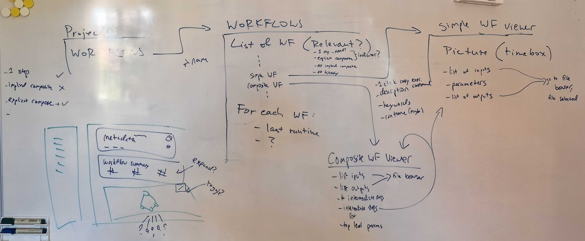
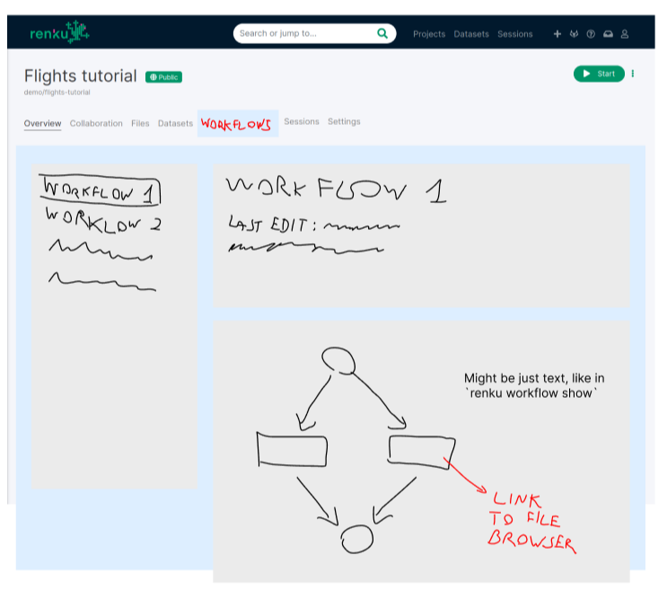

# Project workflows UI view

Created: August 4, 2022 5:32 PM
Tags: UI, workflows

---

## 🤔 Context and Problem

One of the core premises of Renku is to expose connections between code and data. However, the only place in the web UI where users can see any of this information for a project is in the lineage view. That view is incomplete at best and not particularly user-friendly. It is not easy to find out about it in the first place unless you are specifically told where to look. We have a nice abstraction for workflows (plans and provenance) and we should expose it in the UI so it can contribute to understanding what happens in a project. Just like `Datasets` abstract which data is important in/for a project, `Workflows` abstract which processes are relevant for turning data into results.

In addition, we have significant inconsistency between what users experience in the CLI vs. the web app. In the CLI, a user can list/view/modify/create workflows, whereas in the UI they cannot do any of those things. We need to start offering UI views that expose these concepts.

This mini-project is a starting point to rectifying this situation. The thrust of the feature is not so much *action* but *understanding* - what is happening in a project, how complex is the path to achieving a result, what is needed to transform data into results? It should satisfy some basic user-story questions:

- As a user of Renku, I browse through my projects in the web app and I want to quickly see which kinds of workflows I’ve created.
- As a user of Renku, I look at my colleague’s projects and want to understand the kinds of processing required to generate the results they’ve shown me.

In both cases, seeing the data dependencies, the code required, and the outputs generated is the basic requirement. Additional metadata about a workflow/pipeline might be nice to have, e.g. typical duration of execution.

## 🍴 Appetite

Tracking and explaining what happens with data is one of the key premises of Renku. Data provenance tracking is also what drives interest in Renku as a platform, so improving the state of how this information is made available in the web app should be a priority. We can and should dedicate a full two sprints to getting a first iteration of the workflows view within a project.

## 🎯 Solution

Boundaries of the solution/implementation: 

- Only focus on the workflows view *inside* a project
- Listing and viewing only; no editing, no executio

### Interactions

The flow can be broken down like this:

- From the `Project` view, enable navigate to a `Workflows` view
- `Workflows` view shows a list of workflows with *very* basic information (e.g. name & last time it was executed)
- Clicking on a workflow name opens the workflow in the viewer; this includes a panel of *basic* metadata and a panel with a workflow visualization.
- Each workflow view should allow the user to see the data dependencies (inputs), the results (outputs), the commands/code used, and the parameters; clicking on elements of this listing (i.e. files) should take the user to the file viewer - yes, this is a dead-end for now because there won’t be an obvious way to get back to the workflow viewer apart from clicking the “back” browser button 💀
    
    
    
    *Sketches on Figma: [https://www.figma.com/file/PbmaCBxOyIV96TNT4LZYzL/Workflows-visualization*](https://www.figma.com/file/PbmaCBxOyIV96TNT4LZYzL/Workflows-visualization*)*
    

### Some additional constraints

- The workflows listed *should be relevant to the files in the current repo tree*, i.e. we are not listing all workflows that ever ran but only ones that are related to the current files that we see
    - This means to list only  `Plans` that have an `Activity` that touches a file currently in the project file system.
    - Listing Workflow Executions (`Activities`) is *out of scope* of this feature iteration.
- We have two potential types of workflows - “composite” (consisting of multiple steps) and simple (single-step, i.e. result of `renku run`). They should be visually differentiated but listed together.
- The listing is **flat** (no hierarchy for composite workflows)
- For composite workflows, a listing of sub-steps/workflows should be included; clicking on an entry goes to the view of that workflow

### Design

One starting point is the Coteries lineage view - see the design doc:

[Renku - User interface Iteration 3: Lineage and Sessions](https://www.figma.com/file/QPY70ShZESlhUjj5GTPhFt/Renku---User-interface-Iteration-3%3A-Lineage-and-Sessions)

Link to preview: [https://www.figma.com/proto/cmVH2YlFGz6uAv2EEH1sBZ/Renku---User-interface?page-id=1%3A2&node-id=187%3A2088&viewport=1613%2C-2648%2C0.6&scaling=scale-down&starting-point-node-id=29%3A756](https://www.figma.com/proto/cmVH2YlFGz6uAv2EEH1sBZ/Renku---User-interface?page-id=1%3A2&node-id=187%3A2088&viewport=1613%2C-2648%2C0.6&scaling=scale-down&starting-point-node-id=29%3A756)

**Some examples of workflow viewers**

- Real workflows get messy - see, for example, [this one](https://view.commonwl.org/workflows/github.com/mnneveau/cancer-genomics-workflow/blob/master/detect_variants/detect_variants.cwl) from the CWL workflow viewer.
- Kedro has a really nice workflow viewer: [https://demo.kedro.org/](https://demo.kedro.org/)
- The [rabix composer](https://github.com/rabix/composer) is a CWL workflow editor - not as clean as kedro’s viewer, but also serves a slightly different purpose
- Mage has a really nice and simple viewer/editor: [https://github.com/mage-ai/mage-ai](https://github.com/mage-ai/mage-ai)

### Required data from APIs

- Get the list of workflows *relevant to the files in the current repository tree*
- Get details for the target workflow

### The Workflow Tab vs Lineage View

We’d like to rework the file browser in a future pitch. For the scope of this pitch, *remove the lineage view* in the file browser so as to remove confusion between the two viewers.

## 🐰 Rabbit holes

- APIs: it would be great to get data from the KG or even a new workflow service, but we are missing a few pieces for the KG and a new workflow service is not in the scope; we might *need* to rely on renku-core. Keep this in mind when planning for the new APIs.
- Layout: this is a new page, we can go for any layout. We might want to have a coherent UX in the future for browsing files, workflows, and datasets.
- Terminology: In the CLI, we use `Plan` and `Activity`, but these names aren’t intuitive for a user. We’d like to move towards using the terms `Workflow Plan` and `Workflow Execution` going forward.

## 🙅 Out of scope

- Building a new workflow service is not something for this mini-project. There are a few reasons for that:
    - Bootstrapping a new service is a time-consuming activity, even if we already have experience with similar backend microservices (we might even want to try a new framework like [FastAPI](https://fastapi.tiangolo.com/))
    - We don’t *really* need it for now. We are going to get data from a single source and we won’t add/edit anything. Remember one of the Shape Up principles: do not over-complicate features and do not over-engineer the code. We can add the new service later when the benefits will be more obvious.
- File viewer: we know it can be improved in order to make workflows more findable/discoverable, but that’s terrain to explore in a [separate mini-project](https://www.notion.so/Broadly-Accessible-Workflows-via-a-Workflow-File-ff042b0942374a399321b6bdf67b9df5). We can live for some time with workflow pages linking to file browser pages even if there is no way back.
- Workflows page (outside of the project context) and workflows in the search page: these topics are somewhat related to this mini-project, but we can’t include everything, especially since working on them might require a lot of time. Also, the required infrastructure is still not mature. Let’s address them in a follow-up mini-project.
- Showing *executions* (i.e. manifestations of a workflow plan) is not expected for this iteration.
- Graph visualization: it’s tempting to design a brand-new graph explorer, but that might be really time-consuming, or end up providing a bad UX (see lineage?). Starting from a textual output will be a quick and reasonably effective solution. We will propose the visualization as a separate feature.
    - On the topic of graph visualization, some things that do not work well with the lineage view:
        - showing information inside the nodes is not great/easy. For example, see the “execution” node (diamond) below:
        
        
        
        - with many nodes (>50), the visualization becomes messy very quickly
        - it lacks some additional interactions that would make it possible to see additional data or metadata, in the sense of the renku CLI `renku workflow visualize` command (but probably with some fewer details):
        
        
