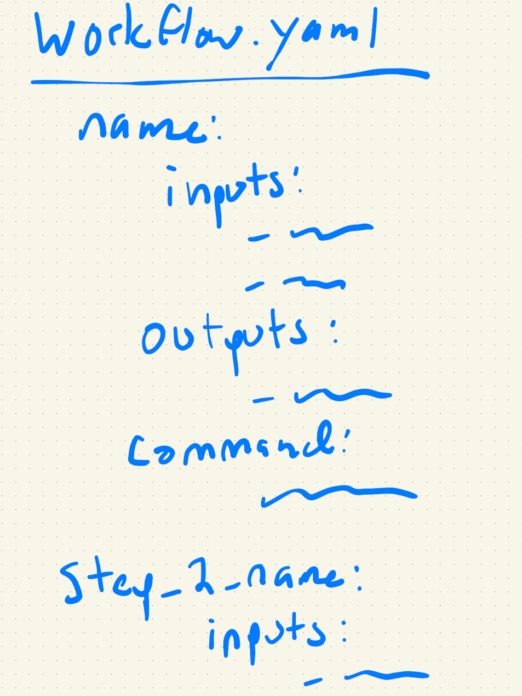
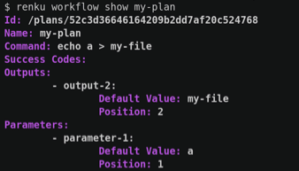

# Broadly Accessible Workflows via a Workflow File

This feature will make Renku workflows more functional for experienced coders. But even better, it will make workflows easier to teach and learn, and make the world of workflows accessible to a broader audience.

## 🤔 Context & Problem

Workflows are Renku's reproducibility “last frontier”. Renku helps users with code versioning, dataset metadata, environment containerization... but workflows remain one of Renku’s least used features. Why is this?

CLI tools require the user to maintain a mental model of what’s happening with every command they run. This additional layer of abstraction is the reason why we only expect advanced users to use CLIs at all. For example, a person who understands git well gets the job done quickly with CLI commands, but someone new to git will prefer to use their IDE’s GUI or the GitHub web or desktop app.

As long as Renku workflows are only available on the CLI, only the most advanced users will use them. But Renku’s mission is to make reproducible research *easy* and for *everyone*, not only the technically advanced! So, our first motivating question is *what can we do to make workflows accessible to a broader audience?*

Additionally, there is a common challenge we run into when introducing Renku workflows to users who *do* want to use workflows: it is cumbersome/just-not-tenable to create and develop (modify) workflows of more than a few steps. Many workflow users have 10+ steps in their workflows [[source](https://sdsc.atlassian.net/wiki/spaces/RENKU/pages/2246541341/Reproducibility+on+HPC)]. Entering 10+ steps on the command line is tedious to do once, but even more significant is that modifying that workflow- which users do all the time as they develop their pipeline- requires recreating and rewiring steps again and again on the CLI. Some users end up writing a script to call a series of Renku run commands [[ORDES example](https://renkulab.io/projects/renku-stories/digirhythm/files/blob/src/build_workflow.sh)]. Renku should provide a built-in way to create and develop multi-step workflows via a file!

## 🍴 Appetite

We’d like to invest 2 sprints (6 weeks) for making workflows more accessible to a broader audience.

## 🎯 Solution

We’d like to offer the ability to define Renku workflows in a file, where the full workflow is laid out for the user to plainly see and edit.

I’ve done a [survey of popular workflow tools](https://sdsc.atlassian.net/wiki/spaces/RENKU/pages/2310701105/Workflow+Tool+Research), and YAML seems to be a common choice for a workflow file, but we leave the final decision to the team.

The workflow file names a sequence of steps, and each step names its command, inputs, outputs, parameters, etc. Each step should be named so that it can be referenced for running individually. I imagine that the structure of the workflow step definition in the file would be pretty similar to the output of `renku workflow show`.

As a nice-to-have, the workflow definition file should allow for the specification of workflow annotations and additional metadata.

For the scope of this pitch, expressing `renku workflow iterate` in the workflow file definition syntax is _out of scope_, along with any kinds of looping or branching.

### Editing workflow files

The workflow file is opened and modified just like any other code file in the project. This pitch requires no changes to the UI.

The user should be able to create more than one workflow file in a project.

### Running workflow files

The user will still use the CLI to run the workflow, referencing the workflow via the workflow file name or the workflow name (TBD exactly how this works). To improve usability for non-CLI users, in tutorials, we could perhaps demonstrate running shell commands from inside a notebook (`!renku run workflow.yml`).

Developing a workflow should be as simple to the user as editing the workflow file, executing the workflow file on the CLI, making further modifications to the workflow file, executing the workflow file again, etc. Renku should not interrupt or slow down this development process. 

The user should be able to run a specific named workflow step from a file without running the whole file (a la `renku run workflow.yml step_1`). This functionality is valuable because it provides an immediate benefit to users to develop workflows _as they code_, not just at the end of the project to encode the final project flow. Providing indexable workflows means users can encode workflow sub-steps they run frequently, such as re-computing a figure, without having to re-type a long command. As a _nice-to-have_, it would also be nice to support running a subset of steps, for example `renku run workflow.yml --from step_name_3 --to step_name_6`.

### Updating file-based workflows

`renku update <file-based workflow>` should check if the workflow file has been changed since last execution as well as if any of the steps' inputs have changed, and offer to run it again. TBD whether we can be smart and only run the affected subset of the workflow (For example, if a workflow has steps A -> B -> C and step B changed, only run B and C, not A).

Simiarly, `renku status` should check for file-based workflows where the definition file has been modified (or inputs have been modified).

### Improving workflow user awareness: A workflow file template

In order to increase workflow usage, we also need to make users aware of them. To this end, it is worth considering adding a template workflow file to the default Renku project structure. For example, this could be a workflow file with a few example workflow steps written out but commented out. The user can uncomment it and replace the placeholders with their command, inputs, output, etc. There could also be a comment at the top of the file describing how to run the workflow.

This would put workflows in front of more users, increasing awareness and hopefully also adoption. 

### UX Note: Re-runnability & Pre-existing Outputs

A common frustration users have with current Renku workflows is that the `workflow` & `run` (mostly `run`) commands errors when you run a workflow command that writes an output file that already exists.

Users do this frequently during development: run script `a`, generate file `b`. Change script `a`, rerun, generate a new b. Great, now you're happy with script `a`, so `renku run script_a` one last time to record it. But now Renku complains that no outputs were generated (because file `b` already existed, so nothing was detected)! Users *can* avoid this by telling Renku explicitly that the output is file `b`, but that's more typing. More commonly, users end up deleting output files before every `renku run`, which they- very reasonably- don't like doing.

The file-based workflow feature should solve this. The workflow should read the specified output in the workflow file, rather than detecting changed files. This removes the need for the user to delete the file so that Renku can detect its creation.

## 🐰 Rabbit Holes

### Venturing into the Metadata Realm

This pitch will require a substantial effort to make the metadata all play nice. Without diving into implementation details, here are a few high-level requirments that the metadata must meet in order to provide a good user experience:

* The workflows defined in files should be fully represented in the Renku KG metadata.
* However, the workflow file itself should be the single source of truth for the workflow definition (not the KG metadata).
* File based workflows can only be edited via the file. These workflows cannot be edited via the CLI or (in the future) somewhere in the RenkuLab UI.
* In terms of versioning a file-based workflow, the metadata should contain metadata about the file-based workflow at each execution. There is no need to maintain a history of the file-based workflow at commits where the workflow was modified but not executed.
* However, the KG must be aware of the latest state of the workflow file (even un-executed or not committed), because other parts of RenkuLab will be pulling information about the workflow via the KG (for example, the workflow browser will query the KG for the file-based workflow definition, and this needs to be up to date with the current state of the file so as not to confuse the user, even if the workflow file has not been executed since it was last modified).
* It has been considered that there might be a need for a command to force-save the file-based workflow to the Renku metadata without executing it. For example, this might be helpful if the user modifies the description of the workflow, and wants to save this information to the KG without running their whole long-running workflow. However, the idea that there is a "save" beyond "file save" is a ugly area we'd like to avoid forcing upon the user if possible, so let's assume this is not needed. But the implementtion team should keep an eye out for other corner cases that might require such a command. 

### Misc Rabbit Holes

**How do you handle when a workflow step generates many files?**

As is the state of the current workflow functionality, inputs and outputs may be directories, rather than files, to support multiple files. However we don’t support any kind of wildcard syntax.

**How does this feature mesh with the current workflow parameter file functionality?**

Currently, the user has the option of creating a file specifying workflow parameters, and passing this in to `renku workflow execute` to override the default parameters. In the future, the combination of this parameter file and the workflow definition file could develop into a sort of base workflow + several “variation” files defining a set of related workflow experiments. But work into this direction is _out of scope_ of this pitch. 

**Should one workflow file be able to reference another workflow file? (i.e. to compose workflows between files)**

My default is *no*, keep it simple for the scope of this pitch.

## 🙅‍♀️ Out of Scope

There are a lot of feature-rich workflow tools out there already. We’re not trying to make the *best* workflow tool, and not even a comprehensive one. If we can get a researcher started using workflows for the first time because simple workflows are easy to create in Renku, and then that user switches to a different workflow tool that suits them better, that’s a win for Open Research!

We’re not trying to make a comprehensive workflow tool with lots of functionality. We’re trying to make the *minimal* workflow tool a user can learn, so they can take their research project to the next level of reproducibility. So, the file-based workflow syntax need only support a minimal set of workflow functionality.

Specifically, the following items are out of scope for this pitch:

- Expressing `renku workflow iterate` in the workflow file definition syntax
- Any kinds of looping, branching, and wildcard syntax
- Any effort to combine the functionality of the currently existing parameter file and the workflow definition file, for example to define a set of related workflow experiments
- Generating a workflow file from an already existing renku worklflow or `renku run`

On a separate note: Another frustration that users run into when using `renku run` and `renku workflow` is our requirement that the git working tree be clean before running either of these commands. Though we would like to figure out a better UX for this, doing so it outside the scope of this pitch.
