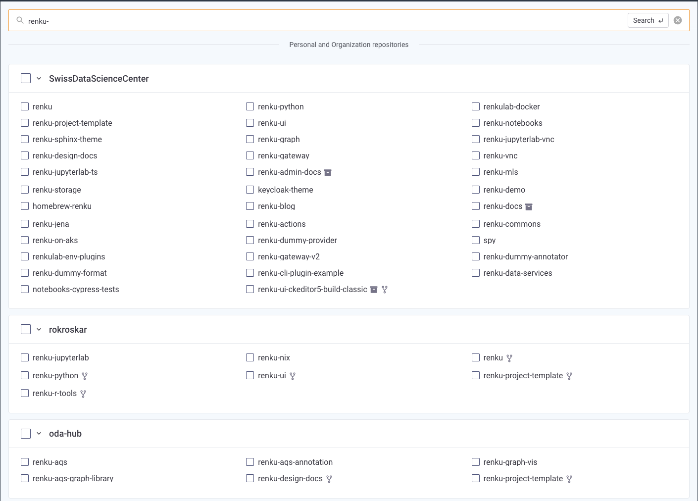
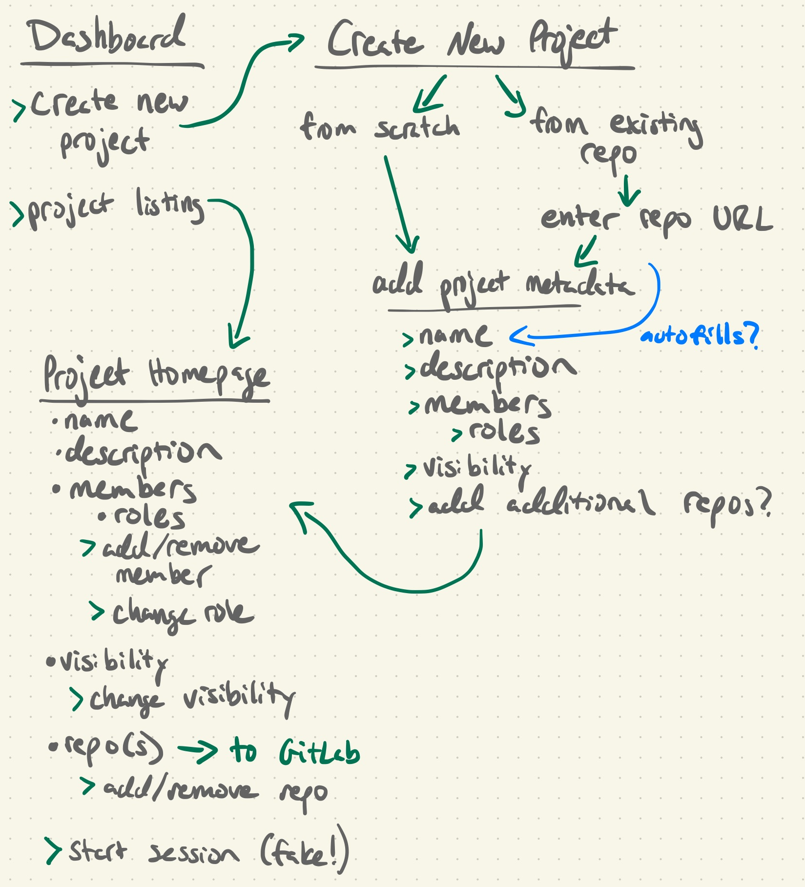

# Exploration: Define Renku Projects and Users

Authors: Rok Roškar, Laura Kinkead

## 🤔 Problem & Context

The current implementation of Renku borrows the concept of a *project* from GitLab; i.e. a git repository in GitLab is also a Renku project. This was convenient to get Renku off the ground quickly, but has quite deep implications from data/code sources to authentication and access control.

Renku inherits all access control (to data and code) from the connected GitLab instance which makes it difficult to introduce new concepts around access (e.g. for compute resources) because access policies always need to somehow be synced with the GitLab permission model. It has therefore become imperative that we decouple the notion of “Project” from GitLab.

Decoupling projects from GitLab has a lot of implications and will enable many positive developments. *This pitch is not about doing a full decoupling and replacement*, but rather it focuses on creating the project resource with minimal functionality to get us started.

## 🍴 Appetite

This is a critical *enabler* for many future use-cases; devote 6 weeks.

## 🎯 Solution

The fundamental task here is to enable the creation of Renku projects *without* GitLab as the source of projects. The most basic functionality is project creation and access control, which require a *******Project******* and a ****User**** concept to be developed.

### User Flow

The user should be able to see a list of projects they have access to (akin to our current Dashboard) and to create a project from there. The new project should be configured with minimal effort and proceed in a few steps. Project creation should not feel like a chore.

In a first step, very basic information needs to be entered at this stage, like a name, visibility (private/public), and optionally a description.

In a second step, the user can optionally link an existing git repository to the project. In this iteration, we restrict git repositories to come from the GiLab instance that is already linked to the Renku instance; in the future, the user will have a choice to configure additional repository sources (e.g. GitHub or another instance of GitLab). Ideally, we could show a list of existing repositories here and provide a simple fuzzy search/autocomplete like is usually the norm for such integrations - this is the dialog in snyk that accomplishes this task:

However, for the first iteration it’s also OK to cut corners here and simply accept (and validate) a repo URL. We should check that the repo exists. *********************It is not expected at this point that we do anything with the repository from Renku.*********************

Finally, we should offer the possibility to add collaborators to the project. This should be a simple dialog with fuzzy search over users in the renku instance. The permissions at this stage are to be very basic (reader and writer) - for public projects, all users are readers, so the only option is writer; for private projects, users can be either readers or writers.

- Dashboard (simplified)

    → “Create a new project” button

- Project Creation form
  - Step 1: Project metadata
    - Name & slug
    - description
    - visibility (default private?)
    - [optional] Members / people with access
  - Step 2: Repos
    - [optional!] Repository (this needs to allow for multiple repositories within a single project in the future)
      - Ideally, this would be done by accessing the repo source (e.g. GitLab) and letting the user pick a repo they want to add
      - The same flow could allow for the creation of a new repo
      - The initial repo source should be the “renku gitlab”
    - (or skip)
- Project homepage
  - shows all the project metadata
    - → “Modify visibility” button
  - shows repo(s)
    - → Clicking on Repo brings you to GitLab
    - → “Add/remove repo(s)” buttons
  - → (fake) Start Session button

### Project Resource

Projects should be defined as a Renku top-level resource. We should no longer be fetching information about projects from a GitLab API but instead from an internal Renku service. The main operational project metadata should be stored in a DB; the KG should scrape (or receive) this data for search. This will reduce the burden on the KG to provide operational data from the triplestore and focus on search and discovery instead.

Projects should be initialized *without* a repository to begin with; a repository is to be treated as a Project resource. For the time being, the structure of the project’s repository *does not change* (i.e. we are not really doing anything specific with templates here). The Project metadata should include a pointer to the repository with the intention to eventually make the source of Renku project repositories flexible and configurable.

Access to projects should be either “public” (anyone can read and authorized users can write) or “private” (only authorized users can access). Within “private” we should initially implement the minimal set of required roles, e.g.  `reader`, `writer` and `owner` (see section on authorization below). Note that by default *the repository access is separate from project access.* This means that it’s quite likely to encounter a situation where someone might be able to read/write a project but not the repository supplying the files for the project (or indeed vice versa!). This is fine and expected; we should have mechanisms in mind to mitigate surprises, e.g. tell a user “you cannot read the repository although you can read this project; Ask the owner for access.” Handling the synchronization of access between the repository and the Renku project is not in scope for this pitch.

**********************************Required metadata**********************************

- ID
- Name & short-name
- Creation Date
- Created By
- Repository URL (this needs to allow for multiple repositories within a single project in the future)
- Members / people with access

### User Resource

In tandem with Projects, we require Renku-specific information about Users. At the moment, user information simply comes from the GitLab API. Instead, we should obtain information from Renku’s own source; the basis for this could/should be the information we have about a user in Keycloak. This should also be where we could store user preferences, for example.

### Changing the repository source

In this new Project model, the repositories for a Project could, in principle, be changed. This means that we cannot rely on the repository as the source of critical metadata for a Project. It needs to be considered how information about data usage that might come from a linked repository needs to be handled, should a repository be added or removed from a Project.

### Authorization scheme

Roles for project members

- Owner (Can delete and patch in addition to read, automatically assigned to whoever created the project)
- Member (Can only read in case the project is private)
- Admin (Can do absolutely everything to every project - we already have a role for this in Keycloak we just have to respect it here as well)

Project visibility

- Public
- Private (Only project members with roles owner/maintainer can read)

## Deliverables

The goal of this pitch is to establish a working but separate Project creation flow. It is not meant to, at this stage, replace any of the existing components, but to provide a working PoC so we can start to understand the UX and technical trade-offs.

- A user should be able to create, delete and update a project with a rudimentary UI
  - updating includes visibility (access) and other metadata like the description
- Access to projects should be configurable
  - can assign roles to users
  - can change visibility of a project

- ~~An API for creating, deleting and updating projects~~
- ~~Authorization service:~~
  - ~~should make authorization decisions on projects~~
  - ~~access to it via http API~~
  - ~~allows us to encode a set of policies for projects~~
  - ~~allows us to enter project entities in it~~
- ~~A users API~~
  - ~~Not sure exactly what this should do and how much of this should be offloaded to Keycloak [lets discuss in RP]~~

## 🐰 Rabbit Holes

- Synchronization of access rights between the repository and the Renku project - this could lead to a lot of issues with matching users across different systems. Therefore it is best to approach with care; the expected solution here is for the project service to simply indicate what rights the user viewing the project has on the underlying repository.
- Synchronization between Keycloak is done by updating the users table in the data service when the data service sees a valid access token from keycloak for a user

## 🙅‍♀️ No-gos

- For the time being, we limit projects to have a single repository; implementation decisions should, however, consider that eventually there might be multiple repositories per project
- Datasets are so far not addressed here and should be “ignored” for the time being.
- Project duplication or forking of the git part is not in scope
- Project change history should not be preserved
