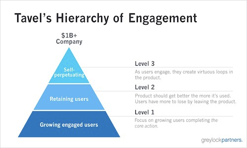
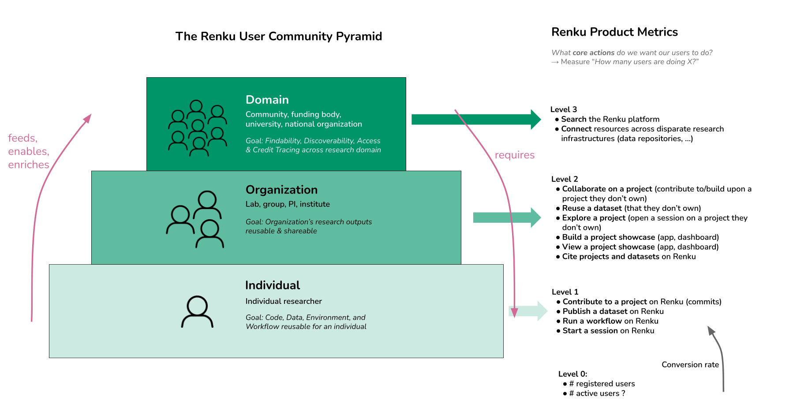

# Build the first Renku Product Metrics

Authors: Laura Kinkead

## 🤔 Problem

- We the Renku development team need to be able to justify Renku to our funders as being worthy of investment and support. We need to be able to answer the question “Is Renku providing value?”, and provide evidence.
- We the Renku development team would like to be able to set targets and know when we have reached them (for example, “We aim to get X% of the Academic Team using Renku”).
- We as the Renku development team need a feedback loop to know whether the features we release are making an impact to our users. Without a feedback loop, we’re flying blind!

## 🍴 Appetite

We would like to spend **2 sprints** on a first implementation of a few starter product metrics.

## 🎯 Solution

Metrics are hard. It is surprisingly hard to figure out what metrics you actually care about, and to get the definition just right. For this pitch, let’s focus on *getting started*- get a few key metrics that we think are our best guesses for what is most important, and get them together in one place.

The guiding idea for the metrics proposed in this pitch is that these metrics should measure *whether the product is successful* at getting users to do the **core action**- i.e. don’t just  measure the *number of users on the platform*, but *number of users who do core action X*. This comes from a metric model called the Hierarchy of Engagement, and you can read more about it [here](https://sarahtavel.medium.com/the-hierarchy-of-engagement-5803bf4e6cfa) if you’re interested.

So, to define Renku’s core actions:

### Renku’s Core Actions

Below are a list of a few of Renku’s core actions. I’ve flagged the ones I think we should start with for this pitch. The non-flagged items are for reference for where we might expand in the future.

TL;DR: **only 🚩 metrics are in scope for this pitch**.

The 💭 metrics are ones to keep in mind for the future, but are **not in scope** for this build.

| Area | Start here | Core Action | Metric |
| --- | --- | --- | --- |
| Projects | 🚩 Must have | Contributing to a project | Number of users who commit to a project |
|  | (💭 for a future build) | Collaborating on a project | Number of users who commit to a project that they do not own (or a fork) | 2 |
| Datasets | 🚩  Must have | Creating a dataset | Number of users who create a dataset |
|  | (💭 for a future build) | Describing a dataset with metadata | Number of users who create a dataset with metadata or add metadata to a dataset |
|  | (💭 for a future build) | Sharing a dataset | Number of users who import a dataset they did not create to a project | 1 |
| Sessions (Env) | 🚩  Must have | Starting a session | Number of users who start a session (on RenkuLab or locally) |
|  | (💭 for a future build) | Sharing a project session | Number of users who start a session on a project they do not own |
|  | (💭 for a future build) | Sharing a project session | Total number of anonymous sessions |
| Workflows | 🚩  Must have | Running a workflow | Number of users who run a workflow |
| Showcasing | (💭 for a future build) | Sharing a project | (?) Viewing a project page one does not own |
|  | (💭 for a future build) | Building an App | Creating an app |
|  | (💭 for a future build) | Viewing an App | Viewing an app they do not own |
| Search | (💭 for a future build) | Searching knowledge | Number of users searching the platform |

Another way of looking at these metrics is via the Renku Community Pyramid ([original here](https://docs.google.com/drawings/d/1In2Z_5PHHZsupSZ2FEjOuDsIPQ7pWjmM-YT0dD__Lxw/edit)):

The metrics in Levels 0 & 1 (Individual) are in scope for this pitch; the other levels are not!

For each of these metrics, measure:

- **#** The number of distinct users who complete the action at least once in the week/month.
  - *This metric allows one to see how usage of the feature is trending overall*
- **%** The # above divided by the number of total users active in the week/month.
  - *This metric allows one to see what percentage of users are completing the core action*

By week/month, I mean that these metrics should be available at the weekly and monthly level.

### The Denominator: Active Users

For the latter %-based metric, we need a “total active users” metric. Let’s define an active user as someone who at any point in the given time period completes ***any*** of the following actions:

- logs in to Renku
- makes a commit (captures project work, dataset creation, running a workflow)
- starts a session

So, for example for the “Contributing to a Project” metric, we would calculate a count:

$$
\text{\# distinct users who have made} \geq \text{1 commit to any Renku projects within week X}
$$

and a percentage:

$$
  \frac{\text{\# distinct users who have made} \geq \text{1 commit to any Renku projects within week X}}{\text{\# distinct active users within week X}}
$$

and the same for monthly-level.

### Storing Metrics Data: up to the Build Team

The technical implementation for how the metrics data is stored is up to the Build Team (for example, whether to use a DB or a bucket).

It is satisfactory, and maybe even preferable, for the raw metrics data to be at the events level, from which the metrics are later aggregated in a second step (by POD, for example).

Metrics should be stored somewhere long-term.

### Access: Easy for the whole Renku team

A need-to-have for this build is that the metrics are surfaced somewhere that is easily accessible by everyone in the Renku team. For example, an S3 bucket (such as the one the Amalthea metrics are dumped to) would be an acceptable destination for this data. Building any kind of dashboard or visualization is out of scope (see No-go: Metric Dashboard/Visualization).

### Frequency: at least weekly

The metrics should be able to be updated (either automatically or via an acceptable level of manual work) no less than weekly.

If this build does get to the other deployments, note that preferably, the metrics data from all deployments lives in 1 centralized storage, not in storage components at every deployment; aka data is pulled from all deployments to 1 central location.

### Consider writing an RFC

A Metrics Design Document should include:

- storage location
- owner
- format
- how are files organized
- data lifecycle, or, we don’t have to clean it up because we expect X amount per year
- expectation on reliability, do we need to back it up?

## 🐰 Rabbit Holes

### Privacy Considerations: include private projects

These metrics will include data from private projects on RenkuLab.

### Institution Level Metrics: pave the way for the future

We will want to be able to calculate these metrics for specific user groups, for example the SDSC Academic Team and for specific institutions. To make that possible in the future, metrics data should be linked to a user or project ID so that once we have an affiliation concept, we can connect to rollup metrics to the institution level.

### Nice to have: Coverage of all instances

For this first build, we need metrics at least from RenkuLab.io. Getting metrics also from the other deployments is a **nice-to-have**.

The metrics across multiple RenkuLab instances can be separate; they don’t all need to be together in one dashboard.

### Nice to have: Historical Data Backfill

It would be nice to have this first iteration dashboard include historical data, but if it’s not doable to load that data in the scope of this build, that’s ok.

## 🙅‍♀️ No-gos

### No-go: Metric Dashboard/Visualization

Creating a dashboard is out of scope of this pitch. For this first effort into the world of metrics, having the data in 1 place is all we need. Visualization can be done by POD later, perhaps in a Jupyter Notebook on RenkuLab. As we look through this data for the first time, we can start to concretize what visualizations we want easy access to going forward, and make a separate pitch & build.

### No-go: Collect more data for CLI-Usage (telemetry)

If there are things we can’t get from users’ local CLI usage, then make a note in the metric definition that it’s missing and let it go for this build. For example, if we have no way of tracking when users use `renku session start` locally, then make a note that that’s missing from the current definition of the metric. And maybe we’ll look into more substantial CLI metrics later.

### No-go: Metric view for Admins

We can imagine that Renku Product metrics may be of interest and value to other RenkuLab admins. Cool! But that’s not in the scope for this first metrics pitch.

### No-go: Spam users

Ideally, spam users should not be included in product metrics. By spam users, I mean users who are abusing Renku, for example creating projects for SEO farming or using sessions for mining.

It is out of scope for this pitch to figure out a way to exclude spam users from product metrics, or even start to quantify how much the metric is affected by spam.

### No-go: De-duping Users

It will be hard to de-dupe users (user may have multiple emails). We don't need to fully solve this for this pitch.

### No-go: Segmenting users into user profiles

We will make to attempt at this stage to classify users, for example:

- classifying a user as using RenkuLab vs the CLI locally.

- determining Whether a user is just following the tutorial, or doing “real work”
