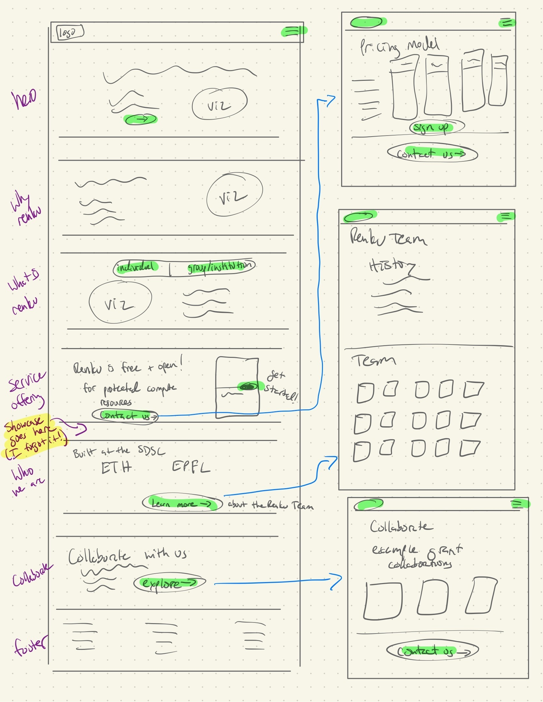
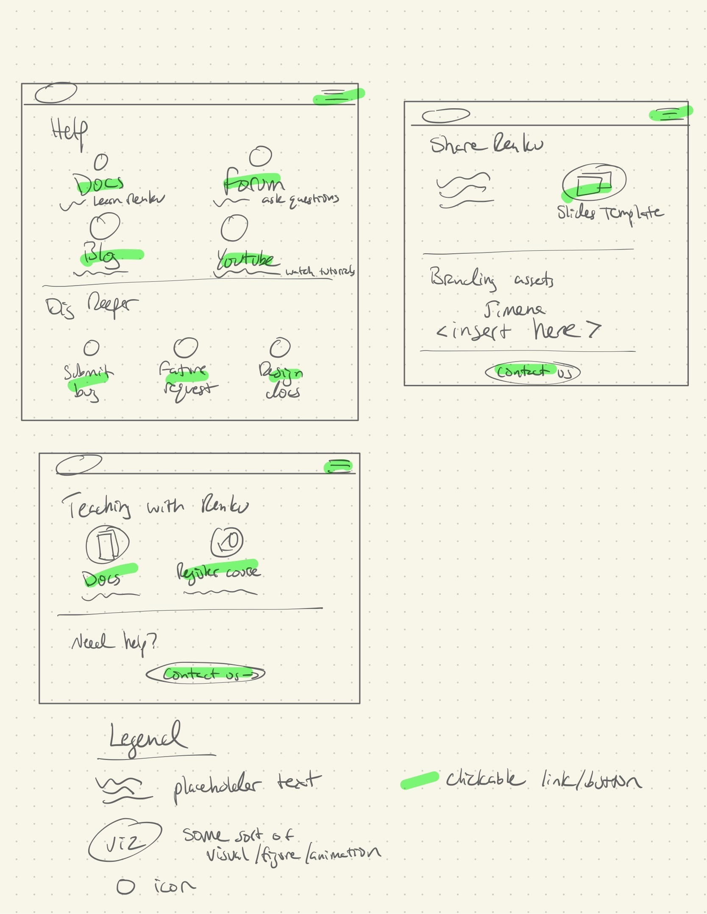

# Redesign Landing Page

Authors: Laura Kinkead, Jimena Dupré

## 🤔 Problem

- The landing page does not well explain what Renku is, and why a user should get excited.
- Renku landing page should be more engaging, with effective CTAs
- The landing page is not state-of-the-art

## 🍴 Appetite

6 weeks for the Copy, Design, and UI to implement the new landing page.

## 🎯 Solution

The main goal is to successfully launch a redesigned landing page that improves the user experience
and answers the three main questions that every user group wants to know: What is Renku?, Why Renku?
and How to use Renku?

### 👥 User Groups & User Journeys

The primary audience for the landing page is people who are hearing about Renku for the first time
and are wondering what it is.

#### People New to Renku

| User Group | Where they enter | Problem | Wants to | Goal Action |
| --- | --- | --- | --- | --- |
| Individual Researcher 🌟 This is the primary user group targeted for this build 🌟 | http://RenkuLab.io (not logged in) | Does not know what Renku is and if they want to use it for themselves | • What can Renku do for me? → See feature overview (for individuals?) • Is it free? → Understand pricing model • Who is behind this and can I trust them? → About Us • What’s it like? → Start “Try it out” project, Start tutorial | Create an account (where do they click this?) |
| Research Group Lead or Institution IT | http://RenkuLab.io (not logged in) | Does not know what Renku is and if they want to use it for their group/institution | • What can Renku do for me? → See feature overview (for groups?) • Who is behind this and can I trust them? → About Us • How much does it cost? → Understand pricing model • What’s it like? → Start “Try it out” project, Start tutorial (less likely than for individual?) | Create an account (where do they click this?) Contact us for more info (this is a bigger commitment!) |
| Teacher | http://RenkuLab.io (not logged in) | Does not know what Renku is and if they want to use it for their course | • How could Renku help me run my course? → Feature overview for teaching • How much does it cost? → Understand pricing model • What’s it like? → ? (I don’t think we have any teaching-specific tutorials) | Create an account (where do they click this?) |
| Potential Collaborator | http://RenkuLab.io (not logged in) | Is curious to learn more about Renku, to decide whether to collaborate with us | • What is Renku trying to do? → What is Renku  | Contact us about writing a proposal |

#### Current users

| User Group | Where they enter | Problem | Wants to | Goal Action |
| --- | --- | --- | --- | --- |
| Individual Researcher needing help | In a session (logged in) | Ran into a bug, I’m not sure how to do something | Find the Docs. If docs doesn’t resolve their problem, go to the forum | Read the docs, Post on the forum |
| Highly engaged user | Dashboard (logged in) | How can I Influence Renku’s development?  | Submit bug, Submit feature requests, Read or contribute to design docs | Get to our GitHub: renku for bugs and small feature requests, design-docs for reading about upcoming bigger features, and maybe contributing • Contact us |
| Renku Evangelist | Dashboard (logged in) | I want support sharing Renku with their organization -  | Access presentation materials | • Download slides & logos • Contact us for further support |
| Teacher needing help | Dashboard (logged in) | How do I set up my course? | Read support materials for teachers | Read teaching docs |
| Teacher wanting to register course | Dashboard (logged in) | How do I make sure Renku doesn’t have maintenance during my course? | Notify Renku team about my course | Register course |

### Fat Marker Sketches

## 🐰 Rabbit Holes

### Customized Landing Page

Admins of other RenkuLab instances should still be able to provide their own landing page.

## 🙅‍♀️ No-gos

- No colors schema changes
- No re-branding
- No content management system
- No Redesign of the menu for authenticated users
- Not in scope: Create a standalone Renku project page that is separate from the instance landing pages (for example, at renku.io).
