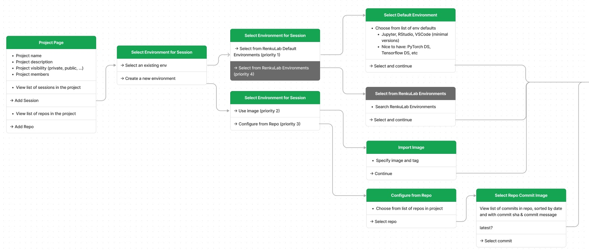
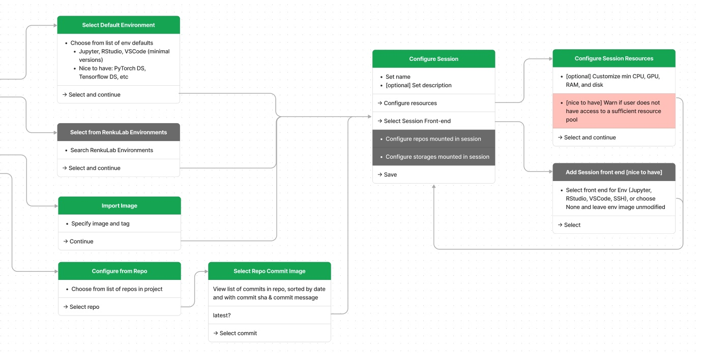
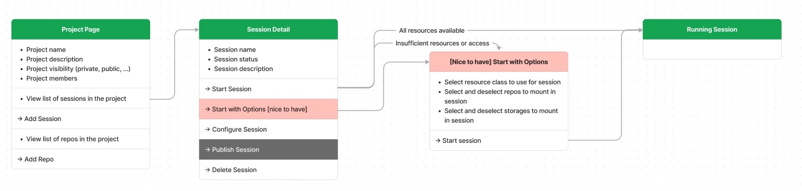
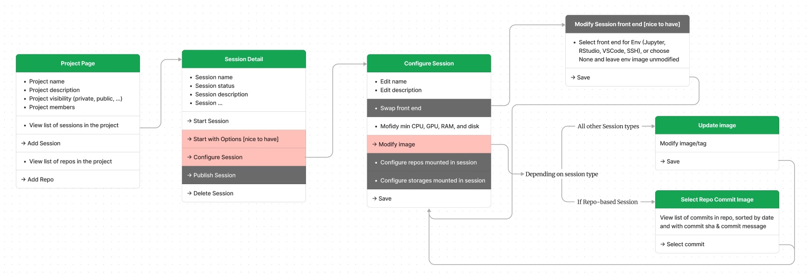
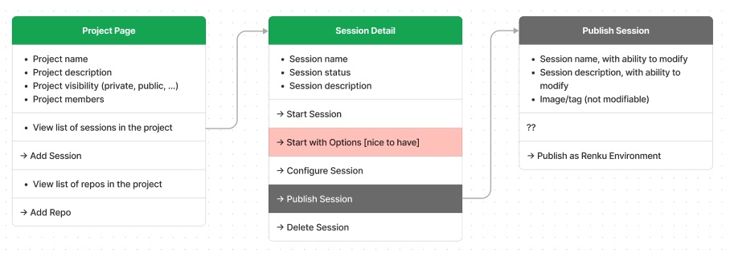
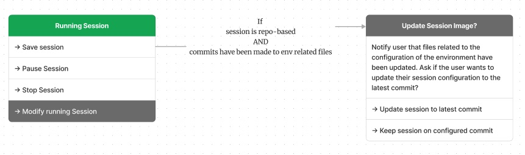

# Renku 1.0 Compute Sessions

Authors: Laura Kinkead, Rok Roškar

<aside>
🔶 Note: We want to make big changes to Sessions in Renku 1.0. I think it’s helpful to keep in mind the **overall goals** we want to achieve in the long term to give context for this pitch, and so I have included much of this context. However, this pitch is about breaking off a 6-week **subset** of that vision! Please pay attention throughout this pitch to when I am painting the picture of what we want in Renku 1.0 *eventually*, and when I am describing the *subset* of that functionality that is scoped for this pitch as something we think we can accomplish in 6 weeks.
</aside>

<aside>
🔶 Note: I use the similar terms “nice to have”, “for the future”, and “out of scope” throughout this pitch.  These terms have some overlap in meaning, so let’s define them up front:
***nice to have**: a small extension that the build team may consider*if there is time*, but is not critical to build in this 6 week scope.
* **for the future**: something that we’re quite confident we want in Renku 1.0, but is not feasible to build in this 6 week scope. But the build team may want to take this future direction under consideration when making design choices this build.
</aside>

## 🤔 Problem

Renku 1.0 needs sessions! But more than that, we want to improve on the current sessions, solving the following user problems:

- When I am starting a new project, I want to **start out with a basic compute environment** (for example with a pre-built data science stack), and I’ll decide what extra packages I need later.
- When I create a new Renku project, I want to get started right away with a pre-built environment- **I don’t want to have to wait for the environment image to be built** to get started.
- When I start a session, I want to **clearly understand what environment image the session will use and what is installed in it**, so I am not confused where the compute environment comes from.
- When I go to launch a session on a project where I recently made an edit to a code file that does not impact the project environment, **I don’t want to have to wait for the image to re-build** since the file I changed didn’t change the environment anyway.

There are a few ways we want 1.0 Environments to work in the future that we won’t be able to make work right away (these are *out of scope* for this pitch), but I include them here to paint a bigger picture and give some extra context for the direction we want Environments to go.

- When I have already created a Docker image for my project that I use in other places, **I want Renku to use that pre-exising image** so I don’t have to re-create a new environment.
- When I know my teammate has already created a great environment they do their work in, I want to **search and reuse that environment** in my own project in RenkuLab.
- When I create a dashboard in a Renku Project, I want to **provide a separate entry point for app viewers** that does not reveal the development environment I use to build the app, so that my app consumers are not confused.
- When I use my Renku project image in other places, I want the **image to be small** so it’s easy to move to other systems (aka not have Jupyter installed in it if I don’t need it).

## 🍴 Appetite

6 weeks.

## 🎯 Solution

In Renku 1.0 (generally, not already in this pitch!), we want to enable 2 key new features:

- Enabling more than one environment per project
- Sharing environments between projects

For these features, we need some new terminology.

### Terminology

#### Environment

An environment consists of a docker image plus metadata. An environment is independent of any one project and can be reused in multiple projects.

An environment has the following properties:

- name
- an image/tag
- metadata:
  - who created it
  - date of creation
- [optional] description (e.g. why it is useful)
- [optional] keywords/tags to aid in searching (for example, I might tag an environment with `#python` `#pytorch` to give a quick impression of what is in the image)

In Renku 1.0, Renku users search and reuse *environments* between projects. (However, enabling environment sharing and reuse is out of scope for this pitch! (See 'Sharing environments to be reused between projects' in the No-gos).

<aside>
🔶 Still to be shaped in the future: Are environments mutable? Are environments versioned? Can a user browse previous or related versions of an environment? Can an environment be updated? If so, are those updates propagated to project sessions that are using them?
→ For the sake of this build, users cannot interact with environments directly.
</aside>

#### Session

A session is an instantiation of an *environment* in a specific project. A user can start a session and have live, interactive access to the project and its code and storage.

Sessions can have the following statuses:

- ⬜ Inactive
- 🕗 Launching
- 🟢 Running
- ⏸ Paused
- ⚠️ Failed/Error

When an *environment* is added to a project, it automatically becomes a project *session* in the state *inactive*.

#### Session Configuration

The session configuration customizes a session for an environment in a project. Via the session configuration, a user can:

- set minimum compute resource requirements
- [nice to have] select which of the project’s code repos to mount in the session [default: mount all]
- [for the future/out of scope] select which of the project’s storages to mount in the session [default: mount all]
- customize the name of the session

When a user wants to customize the resources of their session (compute resources, repos or storages mounted), they modify the *session configuration*.

Session configuration is project-specific.

#### Session Front-End [for the future/out of scope]

In Renku 1.0, we would like to offer that a user can swap out different front ends to their sessions, independently of the session environment. So, a user could find a data science environment on Renku that they want to reuse, and but use VSCode instead of Jupyter as the front end for the session without changing the rest of the environment.

This is something we want in Renku 1.0, but is out of scope for this build for the sake of time.

### User Flows

#### Adding a Session to a Project





A user has 4 options for adding a session to their project. Only the first 2 are considered critical for this build. These options are listed in order of priority, so if this build doesn’t get to implementing all of them, that’s ok.

##### Priority 1: Select from the RenkuLab Default Environments

- These are built and maintained by us
- **At a minimum, 1 default environment must be created as part of the build!** (a Jupyter Python environment)
- These images are pre-built, so launching  a session from one is fast (the user doesn’t have to wait for an image build)
- [nice to have] The default environments should be configured via the admin panel

##### Priority 2: Use an external image

- There are a whole bunch of restrictions for what must be in the image for it to work on RenkuLab. We will have to document these limitations for users.
  - We *think* that any image coming from the Jupyter stack should work
  - ... Or at least Renku base images
- Only publicly accessible images are supported

##### Priority 3 [nice to have]: Configure a Session from a Code repo

- This uses the already existing CI image build pipeline
- We do not automatically update the image that is used for the session when new commits are pushed and new images are built. It is up to the user if they want to update which image is built
- [nice-to-have]: The user is notified when a new image is available and invited to change the image their session uses if they wish.

##### Priority 4: [for the future/out of scope] Search & select from preexisting RenkuLab environments

#### Start Session



#### Configure Session [nice to have]



#### Publish Session [for the future/out of scope]



#### Publish Session [nice to have]



### Things not communicated via the User Flows

#### Starting Assumptions

- In this build, we will not change the project GitLab CI-based image build process (for 'Configure a Session from a Code repo')

#### Key Points

- When a user creates a new project, the project has no sessions until a user adds one.
  - [nice to have] Provide shortcuts for adding a session from the RenkuLab default environments
- A user can create as many sessions as they want in a project.
- A user can run 1 session per environment per project (similar to our restriction now of 1 session per user per project)

#### 1-click to start the Default Session

- One session in a project should be the “default” session, so that we can still offer a 1-click ‘Start Session’ button for the project as a whole, which starts the default session.

#### Permissions

- **Creating sessions:** users with write access to the project should be allowed to create and configure sessions.
- **Launching a session:** For the purposes of this pitch, anyone with access to the project can launch any session that has been added in the project.
- **Viewing running sessions:** Only the user who launched a session can see its status.

#### Inside the session

The session is launched into the `/work` directory. The repositories and external storage sources are provisioned as sub-directories:

```bash
/work
  /repository-1
  /repository-2
  /external-storage-1
  /external-storage-2
```

### Revisiting the Motivating Problems

- When I am starting a new project, I want to **start out with a basic compute environment** (for example with a pre-built data science stack), and I’ll decide what extra packages I need later.
  - → Solved by offering RenkuLab built-in session “templates” (name TBD) as the fastest route to adding a session to a project
- When I create a new Renku project, I want to get started right away with a pre-built environment- **I don’t want to have to wait for the environment image to be built** to get started.
  - → Same as above
- When I start a session, I want to **clearly understand what environment image the session will use and what is installed in it**, so I am not confused where the compute environment comes from.
  - → Solved by defaulting to “pinning” the image when the user chooses the “create session from project repo” route, and not automatically updating which commit image to use.
- When I go to launch a session on a project where I recently made an edit to a code file that does not impact the project environment, **I don’t want to have to wait for the image to re-build** since the file I changed didn’t change the environment anyway.
  - → Same as above

There are a few ways we want 1.0 Environments to work in the future that we won’t be able to make work right away (these are *out of scope* for this pitch), but I include them here to paint a bigger picture and give some extra context for the direction we want Environments to go.

- When I have already created a Docker image for my project that I use in other places, **I want Renku to use that pre-exising image** so I don’t have to re-create a new environment.
  - → Partially solved by offering new option to base a session off of an existing (public) image, and will require further work beyond this pitch to enable accepting non-Renku images.
- When I know my teammate has already created a great environment they do their work in, I want to **search and reuse that environment** in my own project in RenkuLab.
  - → Will be solved in the future by making environments sharable
- When I create a dashboard in a Renku Project, I want to **provide a separate entry point for app viewers** that does not reveal the development environment I use to build the app, so that my app consumers are not confused.
  - → Groundwork laid now by supporting multiple sessions per project. Will be solved in the future with a dedicated Apps pitch.
- When I use my Renku project image in other places, I want the **image to be small** so it’s easy to move to other systems (aka not have Jupyter installed in it if I don’t need it).
  - → Will be solved in the future by implementing the Session Front-End concept.

## 🐰 Rabbit Holes

## 🙅‍♀️ No-gos

### For the Future/Out of Scope: Sharing environments to be reused between projects

In the future, environments will be able to be published and shared between users and projects. We want definitely want to do this eventually, but this is out of scope of this build for the sake of making this pitch fit in 6 weeks. For the scope of this pitch, when a user creates a session from a new environment, that underlying environment is not accessible or shareable in any meaningful manner to the user.

### No Go: Ability to launch multiple environments (images) in the same session

Ability to launch multiple environments within the same session. The user could select e.g. a VSCode and a dashboard app to be launched together, giving them the opportunity to fine-tune the app while having access to a dev environment. We will not enter into this territory with this build, we simply assume 1 environment per session.

### No Go: Shared file system between sessions

With multiple environments per project, it is tempting to imagine that you could launch several of them and have the same underlying filesystem. This is unlikely to be doable in the short-term (we don’t have RW-many storage). The only way it could work is if the sessions/environments were actually separate containers in the same pod. However, users *can* attach the same external storage to different sessions.

### No Go: Changing how GitLab repo images are defined or built

Do not redefine how a user builds an image for an environment or how this environment is defined. We are keeping *exactly* the same mechanisms for building images that exist currently i.e. through GitLab CI and a combination of `Dockerfile` with some language-specific configuration files.

### No go: Access control (user permissions) guarding specific project sessions

We can imagine it would be useful for a Renku developer to develop their project in one session, build a dashboard in another session, and then only give an external collaborator access to the dashboard session in the project (so that the collaborator doesn’t get confused by the development session?).

However, this has potentially large implications, so defer to a future build.
