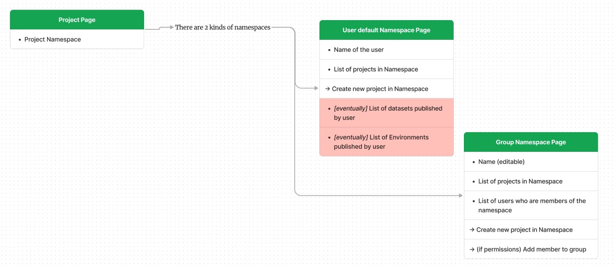
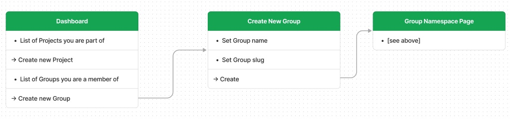
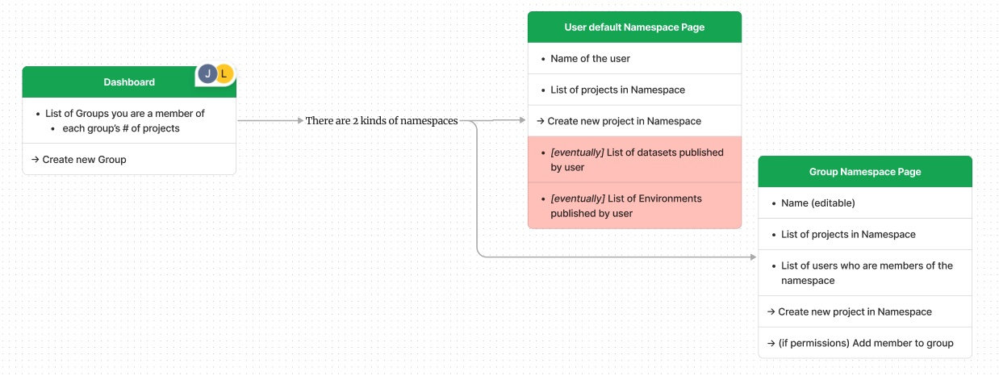
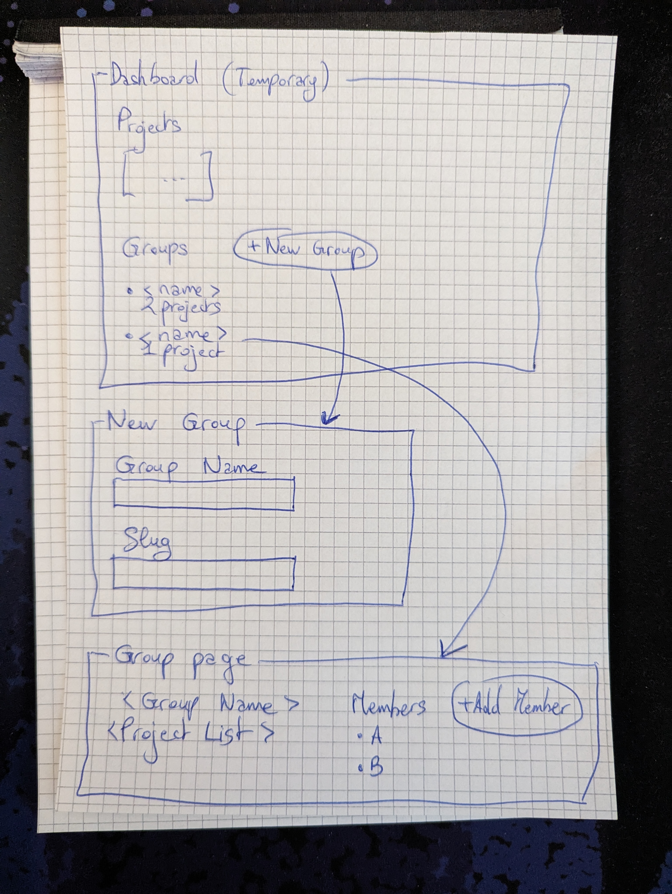

# Renku 2.0 User & Group Namespaces

Authors: Flora Thiebaut, Laura Kinkead

> [!IMPORTANT]
> We are building the next version of Renku! (Currently referred to Renku 2.0) Would
> you like to get involved in shaping the future of Renku? Interested to participate in our user
> research? Get in touch! hello@renku.io

## 🤔 Problem

Renku Native Projects do not have a nice-to-read and memorable canonical URL to access them. Project
and user identifiers are hard-to-read and not memorable.

Also, it is currently not possible to understand who owns a project solely from looking at the piece
used to identify it.

All personal projects from a user should be accessible from a single space which is easy to access.

## 🚞 User stories / journeys

- When I am selecting which namespace to create a project in, I can list namespaces I have access
  to, so I can place the project in the namespace I want
- When I find a project I’m interested in, I can click on the namespace and see all projects in that
  namespace, so I can see if there are related projects that interest me.
- When I am following a RenkuLab link, the url uses a human readable ‘namespace/project’ format and
  not a project id so I have an idea where I am being linked to
- The first time I access the RNP feature, a username is created for me. I can change it later if I
  want to.
- When I rename a namespace, a redirect will be put in place (until the old namespace is claimed) so
  that old links still work.

## 🍴 Appetite

4-6 weeks

## 🎯 Solution

This pitch introduces two types of namespaces: user namespaces and group namespaces. A user
namespace is the default place where a user’s new projects are created. Group namespaces offer a way
to group together related projects.

A Namespace has the following properties:

- slug
- display name
- member projects
- (group namespaces only) user members
  - group admins, who can add and remove group members
  - membership is only visible to members (”public membership” can be done later)

### Namespace Slugs

Identifier slugs can be used to create nice URLs for projects, e.g. `/projects/my-awesome-project`,
but enforcing uniqueness globally on project slugs has major downsides:

- clashes will be frequent
- ownership of `my-awesome-project` is not clear

Using namespaces is a common solution to this problem (see GitHub, Git lab), where project URLs
would be similar to `/projects/flora/my-awesome-project`.

Namespaces have a slug which is the URL part. The rules for a valid slug should be consistent with
the rules for a project slug.

Namespace slugs should be modifiable, otherwise name squatting will be too big of an issue.

### Selecting a User Namespace

Pre-existing RenkuLab users do not have a username! Therefore they will need to select/confirm a
username upon entering Renku 2.0.

Users with access to Renku 2.0 should have a personal namespace which is their username.

Implicit flow:

1. User connects to the Renku 2.0 dashboard or any other Renku 2.0 page.
2. API request checks if there is already a personal namespace for the user.
3. If not, a namespace is created using the GitLab username, or GitLab `username_rand123` where a
   small random string is used in case of conflict.

Changing a personal namespace should be accessible from the “Account” menu (new menu entry).

### User Flows/Breadboard

#### View a Project's Namespace

#### Create a New Group

#### View the Groups you a Member of

#### Fat Marker Sketch

### Namespace Membership and Permissions

A user has access to a project if they have access directly to the project OR to the project’s
group.

| Action | Who can do it |
| --- | --- |
| View a public project in the namespace | Everyone |
| View a private project in the namespace | Namespace members & users added to the project directly |
| View members of the namespace | Everyone |
| Edit a project in the namespace | Namespace members (?) & users added to the project directly |
| Add a project to the namespace | Namespace members |
| Remove a project from the namespace | Project owners/Namespace Admins |
| Add a member to the namespace | Namespace Admins |
| Remove a member to a namespace | Namespace Admins |
| Set a member as an admin  | Namespace Admins |
| Edit the namespace (name, slug) | Namespace Admins |

## 🐰 Rabbit Holes

### Namespace Redirects

After modifying a namespace, a redirect should be put in place (until the namespace is claimed
again).

### Relationship to Hub pages

Group namespace pages share a lot of similarities to our “Hub page” concept for organizational
showcases. However, we will keep group pages extremely basic at this point, and not attempt to add
“Hub Page” concepts to Group Namespace pages.

## 🙅‍♀️ No-gos

Nested groups
