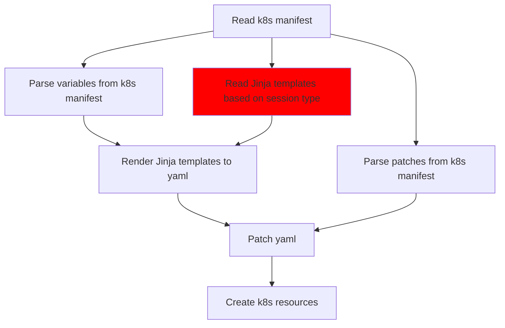

- Start Date: 22-03-2022
- Status: in Progress

# Native Rstudio Sessions

## Summary

Enable Amalthea to support native Rstudio sessions without relying on jupyterlab.
In order to tackle this problem this proposal also tries to make Amalthea even more
general and adaptable so that in the future we can accomodate similar "native" sessions
if the need arises.

## Motivation

The reason for this is that a large portion of Renku users are actually R users.
As such they rely on our R images and Rstudio. But these images include all of the 
regular stuff that a python/jupyterlab image contains in addition to R and Rstudio.
Therefore these images have a problems:
- they take long to build
- they are large
- they are a bit hard to maintain because you have to setup all of the jupyter-rstudio
proxying and make sure that works

## Design Detail

Amalthea (and by extension the notebook service) should support native Rstudio sessions.

Requirements for this feature are:
- Have one k8s resource for both Jupyter and Rstudio sessions. Relying on a different CRD
for each session type is not feasible because: (1) the notebook service has to do extra 
work to merge responses from multiple calls to the k8s API, (2) the performance of the notebook
service degrades the more calls it has to make.
- Enable Amalthea / notebook service to accomodate other types of "custom"/"native" sessions
that may (and will) come up in the future. For now we only have a need for Rstudio-native sessions
but it is very likely in the future a different type of sessions may be needed.

### Current workflow for sessions in Amalthea


There are a lot of assumptions that we "bake into" the hardcoded Jinja templates.
Then further in the Amalthea code we further reinforce and rely on these.

### More flexibility

Add a field in the CRD that defines a set of templates that are used. Here the user
can pick between Jupyterlab or Rstudio. The current Jupyterserver templates can be one of many that are used. Any assumptions or strong decisions made about a specific session's structure, organization, etc. Can be made in these Jupyter or R-specific templates.



### Current assumptions hardcoded in Amalthea Jinja templates
- Session is a statefulset, contains session container and authentication proxy
- Session container listens on port 8888
- Authentication proxy listens on port 4180
- Service points to authentication proxy (4180)
- Ingress points to service which leads only to authentication proxy
- Secrets for Jupyterlab and authentication
- Configmap for Jupyterlab config (mounted in session container)
- PVC for session storage

### Some of these assumptions will remain hardcoded
- PVC/Storage: expect the user to patch in volume mount
- Ingress: keep as is; point service to auth proxy
- Authentication: keep as is; port 4180 is the only entry and it goes through the auth proxy

### Current manifest

Values in the manifest below are for illustration purposes. No Renku-specific values
are hardcoded in the CRD definition in Amalthea.

```yaml
spec:
  culling:
    idleSecondsThreshold: 0
    maxAgeSecondsThreshold: 0
  auth:
    oidc:
      authorizedEmails:
      - <user-email>
      authorizedGroups: []
      clientId: OidcClientName
      clientSecret:
        value: OidcSecretValue
      enabled: true
      issuerUrl: https://dev.renku.ch/auth/realms/Renku
    token: ""
  jupyterServer:
    defaultUrl:
    image:
    resources:
    rootDir: /home/jovyanl/work/<project_name>
  routing:
    host: dev.renku.ch
    ingressAnnotations:
      kubernetes.io/ingress.class: nginx
      nginx.ingress.kubernetes.io/proxy-body-size: "0"
      nginx.ingress.kubernetes.io/proxy-buffer-size: 8k
      nginx.ingress.kubernetes.io/proxy-request-buffering: "off"
    path: /sessions/<session_name>
    tls:
      enabled: true
      secretName: dev-renku-ch-tls
  storage:
    pvc:
      enabled:
      mountPath: /home/jovyanl/work
      storageClassName:
    size:
```

### Proposed revised manifest

```yaml
spec:
  type: jupyterlab # NEW
  culling:
    idleSecondsThreshold: 0
    maxAgeSecondsThreshold: 0
    idleProbe: # NEW
      httpGet:
        path:
        host:
        port:
        scheme:
        httpHeaders:
          - name: Authorization
            value: Basic ...
  auth:
    oidc:
      authorizedEmails:
      - <user-email>
      authorizedGroups: []
      clientId: OidcClientName
      clientSecret:
        value: OidcSecretValue
      enabled: true
      issuerUrl: https://dev.renku.ch/auth/realms/Renku
    basicAuth: # NEW
      enabled: <false by default>
      username:
      password:
  server:
    defaultUrl:
    image:
    resources:
    rootDir: /home/jovyan
  routing:
    host: dev.renku.ch
    ingressAnnotations:
      kubernetes.io/ingress.class: nginx
      nginx.ingress.kubernetes.io/proxy-body-size: "0"
      nginx.ingress.kubernetes.io/proxy-buffer-size: 8k
      nginx.ingress.kubernetes.io/proxy-request-buffering: "off"
    path: /sessions/<session_name>
    tls:
      enabled: true
      secretName: tls-secret
  storage:
    pvc:
      enabled:
      mountPath: /home/jovyan
      storageClassName:
    size:
```

## Notable changes

- We use inheritance in Jinja templates to render the server. There is a "base" set of
templates that both the rstudio and jupyterlab templates inherit from. The server-specific
templates then modify or add things to the base templates that are specific to them.
  - oauth2proxy and the traefik proxy (more on this below) are part of the base templates
  - ingress and service are also part of the base templates
  - the traefik static configuration is also part of the base templates
  - the traefik dynamic config is server-specific and is part of the rstudio/jupyterlab templates
- With the two proxies we are converging on a set of reserved ports:
  - **4180** for the oauth2 proxy
  - **4181** for the traefik proxy
  - **4182** for traefik prometheus metrics and for traefik health check
  - **8888** for the server (i.e. rstudio/jupyter)
  - the k8s ingress just names a service and this service points to 4180 (oauth2 proxy) if
  oauth authentication is enabled, if oauth is disabled the service points to 4181 (traefik)
  directly
- A treafik proxy is used after the oauth proxy. This is necessary because the request for
rstudio has to be rewritten so that things work properly. Also it allows us to have multi
container servers down the line.
- The idle check logic is not in Amalthea anymore because it was specific to Jupyterlab. Now 
Amalthea does a GET request (very similar to a k8s probe) to determine if the session is idle 
or not. If this "idleProbe" returns a status code in the range >=200 and <400 (i.e. success),
then the session is considered idle.
- The token authentication was done at the Jupyterserver level. Rstudio does not support
a similar authentication method. Therefore the token field was removed and replaced with 
the option to do Basic Authentication by Traefik. This requires increased resources because
Traefik has to work much harder to check every incoming request. The templates assign higher 
resource requests and limit if Basic Authentication is used. Therefore by default
all authentication is off and Basic Authentication is more intended for dev or testing or simple cases. 
For Renku the idea is to use oauth for registered sessions and no authentication for anonymous sessions. 
This means that if you have the link to an anonymous session (which will have some id/random string in it) 
then you can access said session even if you did not start it. I think it is nice to offload authentication 
to the proxies and allow the servers to not worry about this at the server level. Also because once you decide to do 
authentication at the server level it is very likely that you will have to do a lot of custom 
templating because every server (rstudio/jupyter/etc) does authentication very differently or even not at all.
- The server probes (and the bane of my existence) are server-specific and reside in the server-specific
Jinja templaets. For jupyterlab it simply uses the old /status endpoint we use currently. 
For rstudio things kind of suck because rstudio needs to set a cookie first and it does this through a redirect. 
But because the request is not coming from a browser the cookie is not saved and the probes fail. 
Luckily this cookie-redirect business is not applied to static resources 
and I set the probe to get the rstudio favicon. This seems to work pretty well so far.
- The server readiness probes go through the traefik proxy. This is necessary in the case of 
rstudio because it expects the request path to be rewritten by the proxy. In addition doing this
through the proxy has the added benefit of implicitly checking if the traefik proxy is up and running too.
- This is now the business of the notebook service or any other user of amalthea. 
But Traefik publishes prometheus metrics that can be used to determine if the sessions are 
idle or not. The metrics show the number of active connections that are established from the 
client application to the server. Preliminary tests show that they react quickly and change when
a user closes an open tab/window with a session in the browser. So using this information we can
setup the git sidecar or another container in the server pod in the notebook service to run the idleCheck.
We can decide whether we rely on this for jupyter servers or we use the more reliable and specific
/status endpoint that shows useful information like active kernels and last activity time.
- K8s probes were added on the oauth2 and traefik proxys. It is unlikely that the server container
would come up before the proxies but it is good to have this in place.

## Drawbacks

We can decide to not do this because currently Rstudio sessions work well. And yes our images
for Rstudio are big and bloated but they work. Changing things introduces the risk of bugs and
requires more effort.

However I believe that the payoff from enable native Rstudio sessions and even more importantly
from making Amalthea and the notebook service more general is worth it.
