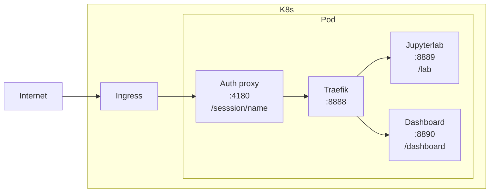

- Start Date: 22-03-2022
- Status: Proposed

# Native Rstudio Sessions

## Summary

Enable Amalthea to support defining more than one container that is exposed and accessible not
just the regular /lab endpoint. In the case of Rstudio currently we support both /lab and /studio
but the proxying for this is done at the Jupyterlab level. The idea here is that such proxying
should be done by Amalthea.

## Motivation

- Users can run additional programs like dashboards beside their regular session
- We can run alternative UIs like vscode or rstudio alongside jupyterlab without relying on the proxying
from rstudio
- We further generalize Amalthea to accept any type of service/container

## Design Detail

### Current manifest

```yaml
spec:
  culling:
    idleSecondsThreshold: 0
    maxAgeSecondsThreshold: 0
  auth:
    oidc:
      authorizedEmails:
      - <user-email>
      authorizedGroups: []
      clientId: OidcClientName
      clientSecret:
        value: OidcSecretValue
      enabled: true
      issuerUrl: https://dev.renku.ch/auth/realms/Renku
    token: ""
  jupyterServer:
    defaultUrl:
    image:
    resources:
    rootDir: /home/jovyanl/work/<project_name>
  routing:
    host: dev.renku.ch
    ingressAnnotations:
      kubernetes.io/ingress.class: nginx
      nginx.ingress.kubernetes.io/proxy-body-size: "0"
      nginx.ingress.kubernetes.io/proxy-buffer-size: 8k
      nginx.ingress.kubernetes.io/proxy-request-buffering: "off"
    path: /sessions/<session_name>
    tls:
      enabled: true
      secretName: dev-renku-ch-tls
  storage:
    pvc:
      enabled:
      mountPath: /home/jovyanl/work
      storageClassName:
    size:
```

### Proposed revised manifest

```yaml
spec:
  template:
    configMap:
      name: jupyter-configmap
  culling:
    idleSecondsThreshold: 0
    maxAgeSecondsThreshold: 0
    idleProbe: # NEW similar syntax expected to http get k8s probe
  auth:
    oidc:
    token:
  servers: # NEW
    - containerName: jupyter-server
      image:
      resources:
        requests:
          memory: 1G
          cpu: 1
      ingress:
        - port: 8889
          url: /lab
      livenessProbe: {}
      readinessProbe: {}
      startupProbe: {}
    - containerName: dashboard
      image:
      resources:
        requests:
          memory: 1G
          cpu: 1
      ingress:
        - port: 8890
          url: /dashboard
      livenessProbe: {}
      readinessProbe: {}
      startupProbe: {}
  routing:
    host: dev.renku.ch
    ingressAnnotations:
      kubernetes.io/ingress.class: nginx
      nginx.ingress.kubernetes.io/proxy-body-size: "0"
      nginx.ingress.kubernetes.io/proxy-buffer-size: 8k
      nginx.ingress.kubernetes.io/proxy-request-buffering: "off"
    path: /sessions/<session_name>
    tls:
      enabled: true
      secretName: dev-renku-ch-tls
  storage:
    pvc:
      enabled:
      mountPath: /home/jovyanl/work
      storageClassName:
    size:
```

### Ingress



### Anonymous sessions
Remove auth proxy, get Traefik to do simple token-based auth. Alternatively also just allow anyone with the
link to the anonymous sessions to access it. The link can be generated with some random characters so that it
is hard to guess.

## Drawbacks

We need to add a traefik proxy in order to do this.

We are adding a bit more complexity to the code.

## Rationale and Alternatives

> Why is this design the best in the space of possible designs?

> What other designs have been considered and what is the rationale for not choosing them?

> What is the impact of not doing this?

## Unresolved questions

> What parts of the design do you expect to resolve through the RFC process before this gets merged?

> What parts of the design do you expect to resolve through the implementation of this feature before stabilisation?

> What related issues do you consider out of scope for this RFC that could be addressed in the future independently of the solution that comes out of this RFC?
