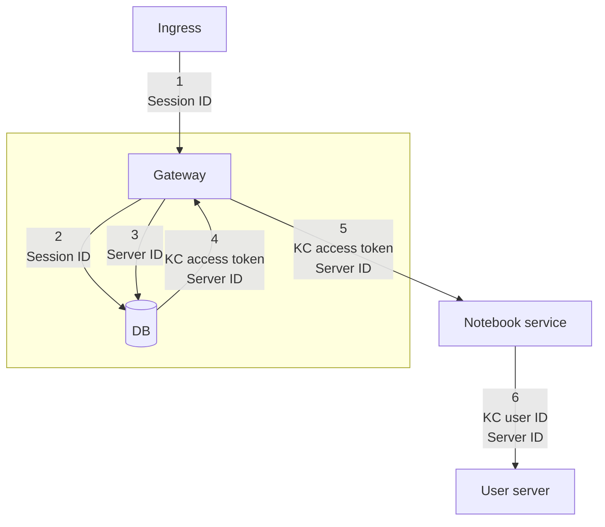
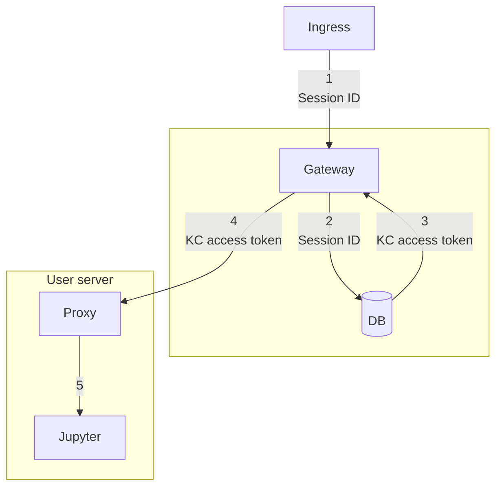
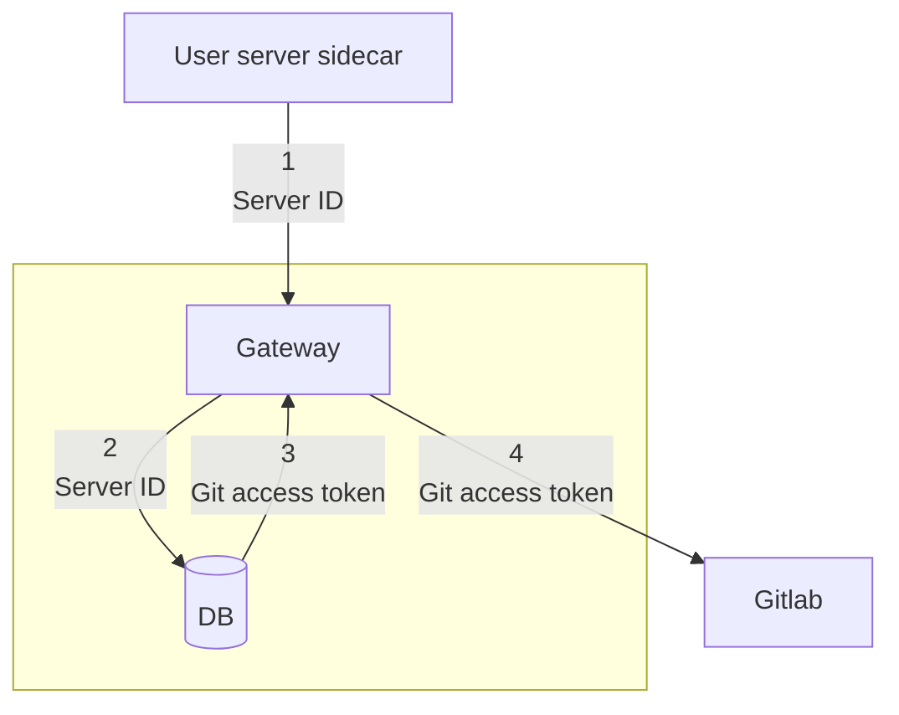
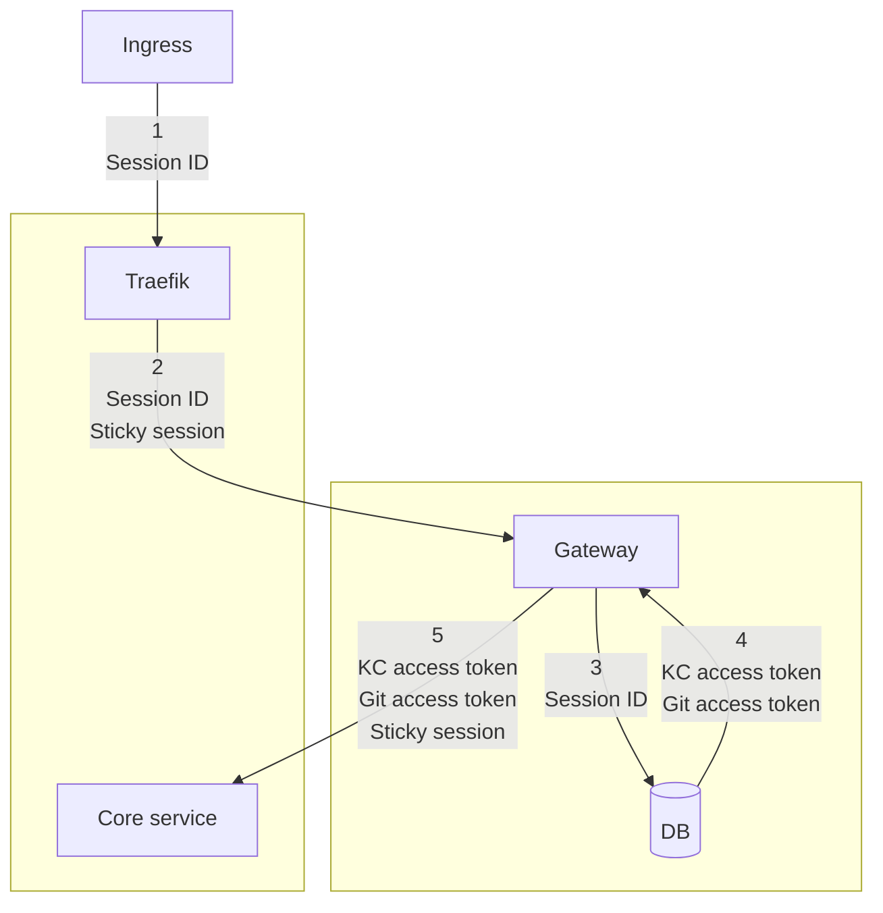

- Start Date: 09-12-2022
- Status: Proposed

# Gateway refactor

## Summary

This proposes a full rewrite of the current gateway service. In addition, it also proposes
changes to the way that access control to Jupyter servers is handled. Currently, each Jupyter
server establishes a session with the user. But going forward each user will have a session
with the gateway which will be used to control access into each Jupyter server. 
The main motivation for changing the access control for Jupyter servers is the desire to run
each Jupyter server in its own subdomain. The problem with unique subdomains is that each Jupyter
server's subdomain would have to be registered in Keycloak so that the Oauth2-proxy in each 
Jupyter server can function properly. But if the Oauth session is handled by the gateway we can
have a single callback address in Keycloak as we currently do.

## Motivation

Reasons for rewriting the gateway:
- the current code base is hard to maintain
- one service could replace both traefik and the gateway
- problems with managing sessions across different services/clients
- using golang should result in more efficient use of resources and improved performance

Reasons for centralized session authentication:
- running sessions in subdomains which would allow for SSH access

## Design Detail

### Gateway

The gateway has to have sessions with different clients. Some of these are:
- User servers (i.e. the sidecar container needs be able to swap some kind of ID
or access token for a Gitlab token)
- Actual users logging in through the UI
- Actual users logging in through the CLI

Using JWT access tokens for this purpose is not feasible. This is because access
tokens from Keycloak expire usually within an hour or several hours. This means
that anyone who has to remain authenticated for a long time with the gateway
needs to also get a refresh token and worry about using this to have valid access
tokens. Accepting an expired access token is not secure.

The gateway should instead have server-side sessions with every "client". For each such
session the gateway will issue a random, hard to guess ID that will be stored either
in a cookie or simply as a secret. This is exactly how sessions are handled by the
ui-server. The cookie or ID is presented with every request to the gateway. The gateway
looks this ID up in redis and if there is a match then any tokens/credentials stored
under that key can be added to requests initiated by that ID.

These sessions are managed/started as follows:
- when a user logs in they get a session
- when a user server is started the server gets a redis-based session
- when a login happens through the CLI there is a also a session
- anonymous users also have redis-based sessions but these are empty
since there is no additional credentials that need to be managed for anonymous users

The gateway then has the following responsibilities:
- store refresh and access tokens
- keep all tokens stored up to date and manage refreshing tokens
- destroy sessions when certain events occur (i.e. when a logout occurs)

### Centralized Jupyter server authentication

### Diagrams

1. Creating a user server

2. Accessing a user server

3. User server sidecar accessing a protected service

4. Sticky sessions for a Renku service

5. Requests from the ui-server

Here the gateway will simply require fully valid Keycloak access tokens
(which the ui-server already has). If this is implemented, the ui-server
will be the only component that will be coming to the gateway with Keycloak
access tokens. All others will be coming with a session ID. So to further
tighten security the gateway can accept Keycloak access token only with the
`ui-server` client as audience and reject all others.

## Drawbacks

- More traffic will go through the gateway
- The gateway will have sessions with multiple clients

## Rationale and Alternatives

1. Why can't we simply use JWT access tokens everywhere?
JWT access tokens from Keycloak expire and it is unsafe to accept expired
access tokens. So if we go this route then everyone who is authenticated
is forced to refresh their access token. But in order to refresh an access token
the services need to receive additional credentials. In addition the services
now much periodically check and worry about keeping their tokens refreshed. This
should not be the responsibilities of renku components but rather on the gateway.
The only expectation of Renku components we should have is that they verify a provided
access token and confirm i) it is valid and ii) has the expected audience and/or claims.

2. Why can't we use the same session ID for users and servers?
The main reason is that these are expected to have different lifetimes.
When a user logs out then their session is removed. But they may leave servers running
that require access to credentials so that they continue operating properly (even
when their creator has logged out). The server session with the gateway will be 
removed when the server is shut down.

3. Why not simply require a user/service to present a Keycloak user ID for authentication
instead of the randomly generated session ID?
Using the never-changing Keycloak user IDs for authentication is dangerous. This means
that the moment someone finds out the ID for a user they can impersonate them. Whereas
using temporary randomly generated session IDs is safer and even if the ID is stolen
the user can be impersonated only for the duration of the session. Renku admins also
have control over these sessions and they can force a specific user to be logged out. Whereas
with static Keycloak user IDs the admin would have to fully remove or disable the user in
Keycloak in order to log them out.

4. Aren't we overlapping with resposibilities and functionality with the ui-server
which already has a session with the user? 
Yes we are. But I am not sure how much of a problem this is. The functionality described here
has to be implemented somewhere and the ui-server does not provide this currently.

## Unresolved questions

Issues to be resolved through the RFC process before this is merged:
- agreement on the resposiblities of the gateway
- agreement on the design and decisions
- whether to use more persistent storage for some sessions that need to be
longer-lived (i.e. sessions for Jupyter servers)

Issues to resolve through the implementation of this RFC:
- potential elimination of traefik in the gateway (all golang web frameworks support reverse proxying out of the box)
- elimination of the git-proxy in sessions (i.e. by using a session ID
the gateway can inject the user's gitlab credentials in requests)

Features out of scope:
- The centralized authentication service for sessions can be implemented as a separate service.
But I think that the fragmentation of the resposiblity of token management/swapping and authentication
should not be spread across multiple services but rather belong to a single centralized entity.
