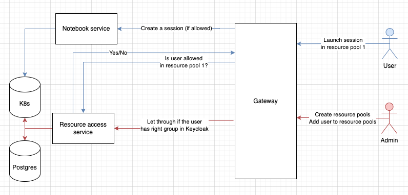
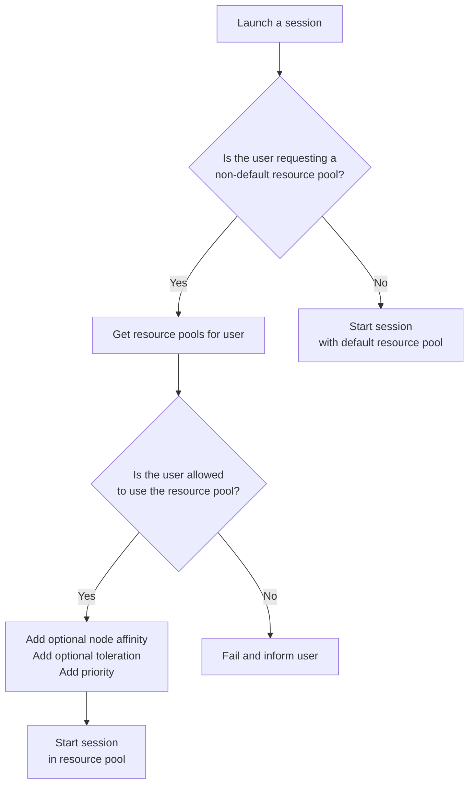

- Start Date: 2023-03-14
- Status: Proposed

# Resource Access Control

## Summary

This RFC proposes a way to be able to control and assign specific users to have access
to specific compute resources.

## Problem Statement

The main motivation for this is to enable Renku admins to control which users have access
to specific computing resources. Currently, there is one set of compute resource options that are
available to all users on the platform. Therefore admins cannot provide or guarantee specific computing resources for specific users. This is a serious problem for the adoption of Renku by groups
within ETH or elsewhere that want guaranteed access to significant computing resources such as GPUs or nodes with a lot of memory or CPU.

Essential requirements:
- user-level access control to CPU, memory, GPUs and storage
- admins provision different resource pools and define these in Renku
- admins assign specific users to specific resource pools
- there is a default resources pool that all users have access to
- resource pools have quotas on how much total resources are available in them
- resource pools contain different flavors/combinations of preset GPU, CPU, memory and storage
- a convenient and transparent way for admins to define resource pools and assign users

## Key Assumptions

- resource pools are assigned on a per-user basis
- Renku admins are in control of creating resource pools and assigning users to them
- information about resource pools is persisted in a database and controlled by a 
  dedicated service

## Possible Solutions

- store all information in Keycloak
- store information in a database with a dedicated service to modify the data
- store all information only in k8s manifests/configmaps

## Proposed solution



Store information about resource pools in Postgres. Create a dedicated service that will expose an API that will allow admins to create resource pools, modify them or assign users
to different resource pools.

Resource pools are enforced with [k8s resource quotas](https://kubernetes.io/docs/concepts/policy/resource-quotas/). 
When an admin creates a resource pool they do the following:
- create a k8s resource quota
- create a k8s priority class that is connected to the quota
- optionally specify which nodes (by label) should be preferred for this resource pool
- optionally provide a taint toleration to be used for this resource pool (the admin is expected to taint the nodes themselves)
- create an entry in Postgres that identifies the k8s quota and namespace
- create entries in Postgres that identify the specific resource classes for the resource pool

### Isolating workloads in k8s

Things are simplified by using a single namespace for all sessions. Resource quotas in k8s can use a `scopeSelector`
to only work on specific priority classes (see [here](https://kubernetes.io/docs/concepts/policy/resource-quotas/#resource-quota-per-priorityclass). 

Different modes of operation:

1. No node taints, tolerations or affinities
  - sessions can be scheduled on any default or untainted session node (subject to resource availability and node sizes)
  - resource quotas still apply (based on priority class)
  - no guarantee which node exactly will be used for the session
  - there is no connection between resource pools and k8s nodes

2. Node taints and toleration, but no affinities
  - sessions can be scheduled on the default pool, tainted nodes or any other untainted nodes that "fit"
  - resource quotas still apply (based on priority class)
  - no guarantee which node exactly will be used for the session

3. Nodes taints, tolerations and affinities
  - assuming affinities are `PreferredDuringSchedulingIgnoredDuringExecution`
  - the session will attempt to be scheduled on the specific nodes
  - if specific nodes are full then the session can be scheduled anywhere else that fits
  - resource quotas still apply

In almost (#TODO: which cases it doesn't?) all cases a session may be scheduled on an untainted node/resource pool that is not strictly
related to the resource pool that the user was "targeting". In this case, the request quota from the targeted resource
pool is consumed.

### Resource pool definition

This is a YAML representation of the data that would be stored in Postgres.

```yaml
- name: default
  classes:
    - name: small
      cpu: 1
      memory: 1Gi
      gpu: 0
    - name: large
      cpu: 2
      memory: 2Gi
      gpu: 0
- name: pool1
  taint: pool1  # optional
  affinity: pool1  # optional
  quota:
    cpu: 10
    memory: 10Gi
    gpu: 10
  classes:
    - name: small
      cpu: 0.5
      memory: 250Mi
      gpu: 0
    - name: large
      cpu: 2
      memory: 6Gi
      gpu: 1
  users:
    - user1
    - user2
- name: pool2
  quota:
    cpu: 100
    memory: 100Gi
    gpu: 0
  classes:
    - name: small
      cpu: 1
      memory: 1Gi
      gpu: 0
    - name: large
      cpu: 4
      memory: 8Gi
      gpu: 0
  users:
    - user10
    - user11
```

### Launching a session



### Interface for creating and assigning resource pools

A lot of complications can occur from how the admins are expected to manage resource pools. Ideally, a very simple UI is available.

Specifying these things through helm chart values is tricky because validation is complicated and feedback
to the admin cannot be easily relayed. For example, the admin specifies an invalid configuration in a Configmap
or a helm chart. They deploy things and now they have caused the resource control service to crash. The admin
now has to look through logs to find the reason and correct it.

Allowing resource pools to be specified and modified only through a simple admin-only UI console avoids this problem.
The admin UI console can be a fully separate single-page application from Renku. The gateway can guard the static
resources for the console such that only authenticated admins can access them. 

## Drawbacks

> Why should we *not* do this? Please consider the impact on users,
on the integration of this change with other existing and planned features etc.

> There are tradeoffs to choosing any path, please attempt to identify them here.

## Rationale and Alternatives

> Why is this design the best in the space of possible designs?

> What other designs have been considered and what is the rationale for not choosing them?

> What is the impact of not doing this?

## Unresolved questions

> What parts of the design do you expect to resolve through the RFC process 
before this gets merged?

> What parts of the design do you expect to resolve through the implementation 
of this feature before stabilisation?

> What related issues do you consider out of scope for this RFC that could be 
addressed in the future independently of the solution that comes out of this RFC?
