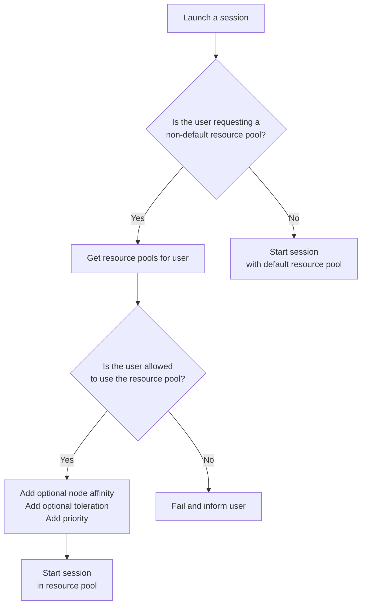

- Start Date: 2023-03-14
- Status: Proposed

# Resource Access Control

## Summary

This RFC proposes a way to be able to control and assign specific users to have access
to specific compute resources when working within user sessions.

## Problem Statement

The main motivation for this is to enable Renku administrators to control which users have access
to specific computing resources. Currently, there is one set of compute resource options that are
available to all users on the platform. Therefore administrators cannot provide or guarantee access to specific
computing resources to specific users.
This is a serious problem for the adoption of Renku by groups within ETH or elsewhere that want guaranteed access to
significant computing resources such as GPUs or nodes with a lot of memory or CPU.

Essential requirements:
- user-level access control to CPU, memory, GPUs and storage
- administrators provision different resource pools and define these in Renku
- administrators assign specific users to specific resource pools
- there is a default resources pool that all users have access to
- resource pools have quotas on how much total resources are available in them
- resource pools contain different flavors/combinations of preset GPU, CPU, memory and storage

Nice to have requirements:
- a convenient and transparent way for administrators to define resource pools and assign users

## Key Assumptions

- A **default** resource pool always exists and all users can access it
- Resource pools are assigned on a per-user basis
- Renku administrators are in control of creating resource pools and assigning users to them
- Resource pools are created through Renkulab which performs some validation on their configuration
- A Renkulab administrator is a Keycloak user that belongs to the `admin` group

## Possible solutions

- store all information in Keycloak
- store information in a database with a dedicated service to modify the data
- store all information only in Kubernetes manifests/ConfigMaps

## Proposed solution

This RFC proposes to solve the stated problem by having the user's request to launch a session pass through two gates:
 1. Does the user have access to the selected resource pool?
 2. Does the selected resource pool have enough quota to accept the user request?

Each of those two gates is implemented by different services, the first is an in-house service that exposes through an
HTTP interface if a specific user is granted access to a resource pool, referred from here on as the **Resource Access Control**
service, with the data kept in a Postgres database.
The second gate is implemented through [Kubernetes resource quotas](https://kubernetes.io/docs/concepts/policy/resource-quotas/)
to define the resource pools and the [resource quota per PriorityClass](https://kubernetes.io/docs/concepts/policy/resource-quotas/#resource-quota-per-priorityclass)
to associate user sessions to resource pools.


### The Resource Access Control service

The service exposes an HTTP API that the administrators interact with to create/update/delete resource pools and
add/remove users to resource pools.

A prototype of the API exposed by the service looks like the following:
```yaml
openapi: 3.0.2
info:
  title: Renku user service
  description: User service with compute resource access control for Renku
  version: v1
servers:
  - url: /api/compute
paths:
  
  /resourcePools:
    get:
      summary: Get all resource pool definitions
      responses:
        '200':
          description: The resource pool definition
        '404':
          description: The resource pool does not exist
      tags:
        - resourcePools
    post:
      summary: Create a resource pool
      requestBody:
        required: true
        content:
          application/json:
            schema:
              type: object 
              required:
                - id
              properties:
                id:
                  type: string
      responses:
        '201':
          description: The resource pool was created
      tags:
        - resourcePools
  /resourcePools/{resourcePoolId}:
    get:
      summary: Get a resource pool definition
      parameters:
        - in: path
          name: resourcePoolId
          required: true
          schema:
            type: string
      responses:
        '200':
          description: The resource pool definition
        '404':
          description: The resource pool does not exist
      tags:
        - resourcePools
  /resourcePools/{resourcePoolId}/classes:
    get:
      summary: Get all resource classes in a resource pool
      parameters:
        - in: path
          name: resourcePoolId
          required: true
          schema:
            type: string
      responses:
        '200':
          description: The resource class in the specific pool
        '404':
          description: The resource pool or class does not exist
      tags:
        - classes
  /resourcePools/{resourcePoolId}/classes/{classId}:
    post:
      summary: Create a resource class in the specific pool
      parameters:
        - in: path
          name: resourcePoolId
          required: true
          schema:
            type: string
        - in: path
          name: classId
          required: true
          schema:
            type: string
      requestBody:
        required: true
        content:
          application/json:
            schema:
              type: object 
              required:
                - id
              properties:
                id:
                  type: string
      responses:
        '201':
          description: Created a class in the resource pool
        '404':
          description: The resource pool does not exist
      tags:
        - classes
  /resourcePools/{resourcePoolId}/users:
    get:
      summary: Get all users that have access to a resource pool
      parameters:
        - in: path
          name: resourcePoolId
          required: true
          schema:
            type: string
      responses:
        '200':
          description: The list of users
        '404':
          description: The resource pool does not exist
      tags:
        - users
    post:
      summary: Set the list of users that have access to a resource pool
      parameters:
        - in: path
          name: resourcePoolId
          required: true
          schema:
            type: string
      requestBody:
        description: List of user Ids
        required: true
        content:
          application/json:
            schema:
              type: array
              items:
                type: string
              required:
                - id
      responses:
        '201':
          description: The list of users was set
        '404':
          description: The resource pool does not exist
      tags:
        - users
    put:
      summary: Append to the list of users that have access to a resource pool
      parameters:
        - in: path
          name: resourcePoolId
          required: true
          schema:
            type: string
      requestBody:
        description: List of user Ids
        required: true
        content:
          application/json:
            schema:
              type: array
              items:
                type: string
              required:
                - id
      responses:
        '201':
          description: The list of users was updated
        '404':
          description: The resource pool does not exist
      tags:
        - users
  /resourcePools/{resourcePoolId}/users/{userId}:
    get:
      summary: Check if a specific user belongs to a specific resource pool
      parameters:
        - in: path
          name: resourcePoolId
          required: true
          schema:
            type: string
        - in: path
          name: userId
          required: true
          schema:
            type: string
      responses:
        '200':
          description: The user belongs to the resource pool
        '404':
          description: The user does not belong to the resource pool, or the resource pool or user do not exist
      tags:
        - users
  /resourcePools/{resourcePoolId}/quota:
    get:
      summary: Get the quota associated with the resource pool
      parameters:
        - in: path
          name: resourcePoolId
          required: true
          schema:
            type: string
      responses:
        '200':
          description: The user belongs to the resource pool
        '404':
          description: The resource pool or user does not exist
      tags:
        - quota
    post:
      summary: Set the quota associated with the resource pool
      parameters:
        - in: path
          name: resourcePoolId
          required: true
          schema:
            type: string
      responses:
        '200':
          description: The user belongs to the resource pool
        '404':
          description: The resource pool or user does not exist
      tags:
        - quota
```

From the above API, it is clear that the service needs to be able to create `ResourceQuota` and `PriorityClass` resources
in the Kubernetes cluster and create the association between users and resource pools in the Postgres database.

A non-essential feature would include a dedicated web page where the Renkulab administrator can log in and interact with
the above API through a user interface.  The interface would also surface errors reported from the API which verifies if
the passed request is possible.

### Advanced resource pools management

In some cases, the administrator will need to dedicate specific Kubernetes nodes to resource pools, for instance when
some user groups are allowed to use GPUs or when the autoscaling profiles for the nodes are different.

In those cases, we rely on the `affinity` and `taint/toleration` mechanisms from Kubernetes. For each resource pool, the
administrator will take care of:
 - (optional) Setting a label on the nodes dedicated to the resource pool
 - Setting a taint on the nodes dedicated to the resource pool
 - Specify toleration and (optionally) a label when creating/updating the resource pool associated to the nodes

The above will result in three different modes of operation:

1. No node taints/tolerations or affinities
  - sessions can be scheduled on any default or untainted session node (subject to resource availability and node sizes)
  - resource quotas still apply (based on priority class)
  - no guarantee which node exactly will be used for the session
  - there is no connection between resource pools and Kubernetes nodes

2. Node taints/toleration, but no affinities
  - sessions can be scheduled on the default pool, tainted nodes or any other untainted nodes that "fit"
  - resource quotas still apply (based on priority class)
  - no guarantee which node exactly will be used for the session

3. Nodes taints/tolerations and affinities
  - assuming affinities are `PreferredDuringSchedulingIgnoredDuringExecution`
  - the session will attempt to be scheduled on the specific nodes
  - if specific nodes are full then the session can be scheduled anywhere else that fits
  - resource quotas still apply

In almost (#TODO: which cases it doesn't?) all cases a session may be scheduled on an untainted node/resource pool that is not strictly
related to the resource pool that the user was "targeting". In this case, the request quota from the targeted resource
pool is consumed.

### Resource pool definition

This is a YAML representation of the data that would be stored in Postgres.

```yaml
- name: default
  classes:
    - name: small
      cpu: 1
      memory: 1Gi
      gpu: 0
    - name: large
      cpu: 2
      memory: 2Gi
      gpu: 0
- name: pool1
  taint: pool1  # optional
  affinity: pool1  # optional
  quota:
    cpu: 10
    memory: 10Gi
    gpu: 10
  classes:
    - name: small
      cpu: 0.5
      memory: 250Mi
      gpu: 0
    - name: large
      cpu: 2
      memory: 6Gi
      gpu: 1
  users:
    - user1
    - user2
- name: pool2
  quota:
    cpu: 100
    memory: 100Gi
    gpu: 0
  classes:
    - name: small
      cpu: 1
      memory: 1Gi
      gpu: 0
    - name: large
      cpu: 4
      memory: 8Gi
      gpu: 0
  users:
    - user10
    - user11
```

### Launching a session



### Interface for creating and assigning resource pools

A lot of complications can occur from how the administrators are expected to manage resource pools. Ideally, a very simple UI is available.

Specifying these things through helm chart values is tricky because validation is complicated and feedback
to the admin cannot be easily relayed. For example, the admin specifies an invalid configuration in a <admin interface>
or a helm chart. They deploy things and now they have caused the resource control service to crash. The admin
now has to look through logs to find the reason and correct it.

Allowing resource pools to be specified and modified only through a simple admin-only UI console avoids this problem.
The admin UI console can be a fully separate single-page application from Renku. The gateway can guard the static
resources for the console such that only authenticated administrators can access them. 

## Drawbacks

> Why should we *not* do this? Please consider the impact on users,
on the integration of this change with other existing and planned features etc.

> There are tradeoffs to choosing any path, please attempt to identify them here.

## Rationale and Alternatives

> Why is this design the best in the space of possible designs?

> What other designs have been considered and what is the rationale for not choosing them?

> What is the impact of not doing this?

## Unresolved questions

> What parts of the design do you expect to resolve through the RFC process 
before this gets merged?

> What parts of the design do you expect to resolve through the implementation 
of this feature before stabilisation?

> What related issues do you consider out of scope for this RFC that could be 
addressed in the future independently of the solution that comes out of this RFC?
