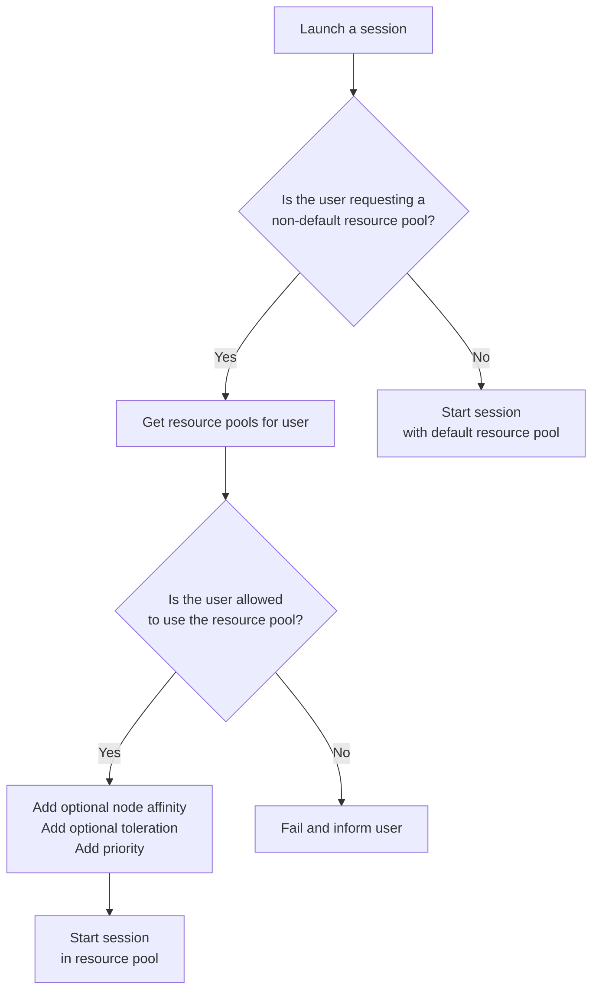

- Start Date: 2023-03-14
- Status: Proposed

# Resource Access Control

## Summary

This RFC proposes a way to be able to control and assign specific users to have access
to specific compute resources when working within user sessions.

## Problem Statement

The main motivation for this is to enable Renku administrators to control which users have access
to specific computing resources. Currently, there is one set of compute resource options that are
available to all users on the platform. Therefore administrators cannot provide or guarantee access to specific
computing resources to specific users.
This is a serious problem for the adoption of Renku by groups within ETH or elsewhere that want guaranteed access to
significant computing resources such as GPUs or nodes with a lot of memory or CPU.

Essential requirements:
- user-level access control to CPU, memory, GPUs and storage
- administrators provision different resource pools and define these in Renku
- administrators assign specific users to specific resource pools
- there is a default resources pool that all users have access to
- resource pools have quotas on how much total resources are available in them
- resource pools contain different flavors/combinations of preset GPU, CPU, memory and storage

Nice to have requirements:
- a convenient and transparent way for administrators to define resource pools and assign users

## Key Assumptions

- A **default** resource pool always exists and all users can access it
- Resource pools are assigned on a per-user basis
- Renku administrators are in control of creating resource pools and assigning users to them
- Resource pools are created through Renkulab which performs some validation on their configuration
- A Renkulab administrator is a Keycloak user that belongs to the `admin` group

## Possible solutions

- store all information in Keycloak
- store information in a database with a dedicated service to modify the data
- store all information only in Kubernetes manifests/ConfigMaps

## Proposed solution

This RFC proposes to solve the stated problem by having the user's request to launch a session pass through two gates:
 1. Does the user have access to the selected resource pool?
 2. Does the selected resource pool have enough quota to accept the user request?

Each of those two gates is implemented by different services, the first is an in-house service that exposes through an
HTTP interface if a specific user is granted access to a resource pool, referred from here on as the **Resource Access Control**
service, with the data kept in a Postgres database.
The second gate is implemented through [Kubernetes resource quotas](https://kubernetes.io/docs/concepts/policy/resource-quotas/)
to define the resource pools and the [resource quota per PriorityClass](https://kubernetes.io/docs/concepts/policy/resource-quotas/#resource-quota-per-priorityclass)
to associate user sessions to resource pools.


### The Resource Access Control Service

The service exposes an HTTP API that the administrators interact with to create/update/delete resource pools and
add/remove users to resource pools.

A prototype of the API exposed by the service can be seen in the attached file: [api-prototype](./api-prototype.yaml)

From the above API, it is clear that the service needs to be able to create `ResourceQuota` and `PriorityClass` resources
in the Kubernetes cluster and create the association between users and resource pools in the Postgres database.

A non-essential feature would include a dedicated web page where the Renkulab administrator can log in and interact with
the above API through a user interface.  The interface would also surface errors reported from the API which verifies if
the passed request is possible.

### Database structure

The database serving as the backend to the Resource Access Control service will have four tables:

```
Quota:
 - CPU
 - memory
 - GPU
 - storage

Resource class:
 - name
 - CPU
 - memory
 - GPU
 - storage

Resource pool:
 - name
 - classes (list of references to resource class)
 - quota (reference to Quota)

User:
 - Keycloak ID
 - pools (list of references to resource pools the user has access to)
```

### Advanced resource pools management

In some cases, the administrator will need to dedicate specific Kubernetes nodes to resource pools, for instance when
some user groups are allowed to use GPUs or when the autoscaling profiles for the nodes are different.

In those cases, we rely on the `affinity` and `taint/toleration` mechanisms from Kubernetes. For each resource pool, the
administrator will take care of:
 - (optional) Setting a label on the nodes dedicated to the resource pool
 - Setting a taint on the nodes dedicated to the resource pool
 - Specify toleration and (optionally) a label when creating/updating the resource pool associated with the nodes

The above will result in three different modes of operation:

1. No node taints/tolerations or affinities
  - sessions can be scheduled on any default or untainted session node (subject to resource availability and node sizes)
  - resource quotas still apply (based on priority class)
  - no guarantee which node exactly will be used for the session
  - there is no connection between resource pools and Kubernetes nodes

2. Node taints/toleration, but no affinities
  - sessions can be scheduled on the default pool, tainted nodes or any other untainted nodes that "fit"
  - resource quotas still apply (based on priority class)
  - no guarantee which node exactly will be used for the session

3. Preferred Nodes taints/tolerations and affinities
  - assuming affinities are `PreferredDuringSchedulingIgnoredDuringExecution`
  - the session will attempt to be scheduled on the specific nodes
  - if specific nodes are full then the session can be scheduled anywhere else that fits
  - resource quotas still apply

4. Required Nodes taints/tolerations and affinities
  - assuming affinities are `RequiredDuringSchedulingIgnoredDuringExecution`
  - the session will attempt to be scheduled on the specific nodes
  - if specific nodes are full then the session will not be scheduled anywhere else

### Launching a session


## Drawbacks

This solution proposes to introduce a new service: it will inherently increase the complexity of the project both in the
development phase (coding, testing, releasing) as well as the operations (availability, scaling, performance).

Additionally, the service will rely on the Postgres instance that we deploy alongside Renkulab as the backend, using a new
database, thus increasing Renkulab's dependency on Postgres.

## Rationale and Alternatives

This design provides a robust and reliable interface for the Renkulab administrator to manage the user access to the
resources and the resource definitions as well. It also provides a solid foundation to build upon more feature that
concerns the Renkulab administrator, providing an interface that will evolve with time but should remain familiar.

Other designs revolved around appending the information about users' access and resource pools to existing entities in
Renkulab (ConfigMaps, Keycloak metadata etc...). Those designs have all the drawbacks of not providing an easy interface
for the administrator to understand mistakes and issues with the configuration.

This feature is essential to reduce the spread of Renkulab.io instances that the SDSC maintains because many of those
exist solely to dedicate compute resources to specific groups.

Consolidating the Renkulab deployments has also the benefit of allowing data scientists from different groups to share
their work across a single deployment.

## Unresolved questions

How to access the administrator interface and how it should look will have to be addressed in the context of
discussing this RFC.

The programming language chosen for the HTTP service and its dependencies will be chosen at the moment of implementation.
At the time of implementation, some considerations on the required network policies so that the service can access Postgres
will be needed.

The problem addressed by this RFC is somewhat related to the topic of cross-cluster resource sharing.
Once this RFC will be addressed, it will be realistic to add to a cluster that hosts a public instance of Renkulab
(e.g. Renkulab.io) some nodes that belong to a research group and that, through the implementation of this
RFC, will be able to access exclusively to address their computational needs while sharing the other resources with the
other users.
