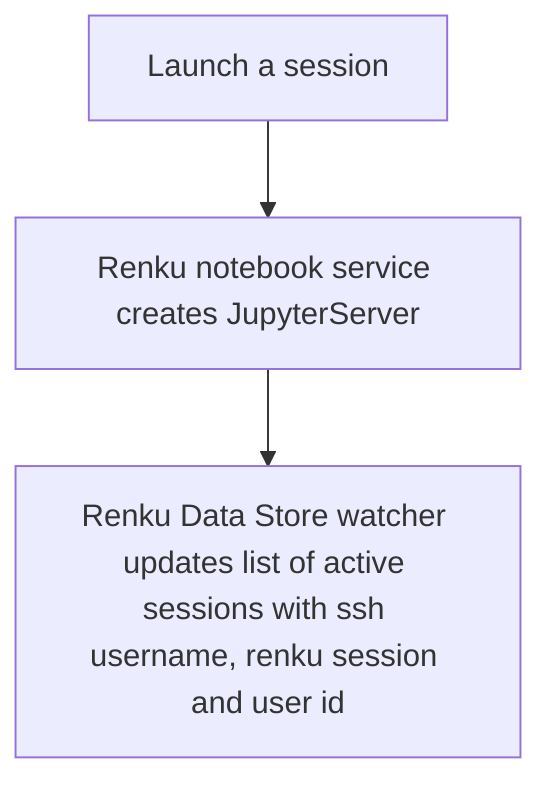
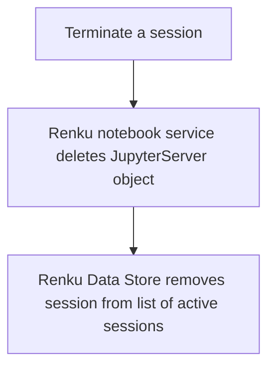
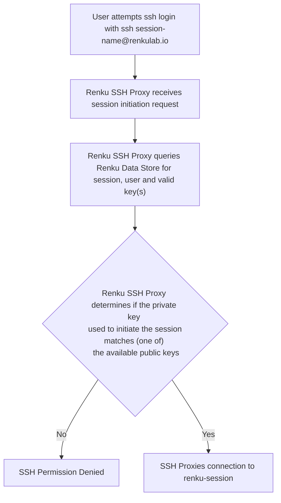

- Start Date: 2023-01-20
- Status: Proposed

# Add ssh support to sessions

## Summary

> One paragraph explanation of the change.

An important requirement which must be met by Renku is to enable users to
log in to their Renku session via ssh; a key driver for this is to support
working with VS Code within Renku sessions.

This has been discussed within the team and an interim solution has been
developed which is currently in operation. That solution, however, has some
limitations; this RFC provides context, documents possible solutions and will
be used to justify the final agreed solution.

## Motivation

> Why are we doing this? What use cases does it support? What is the expected
outcome?

This functionality has been motivated through the Shape Up process and is
documented [here](https://github.com/SwissDataScienceCenter/renku-design-docs/blob/main/feature-pitches/003-ssh-into-sessions/ssh-into-sessions.md).

## Problem Definition

> This section should include a detailed description of the problem and, importantly,
include any specific constraints that arise. It can be as technical as required.

The basic problem is to provide low friction, secure access to user sessions
via ssh. 

Although non key based mechansisms are possible and are discussed to some extent
below, VS Code primarily uses key based mechansims; they are generally the most
widely used with ssh and are known to be trusted and secure - for this reason,
there is a strong focus on key-based mechanisms here.

From a user perspective, a number of different possibilities can be envisaged,
which depend on how experienced the users are with SSH key handling - this can
include different types of SSH keys (RSA, ED25519, etc), password encrypted SSH
keys, use of `ssh-agent`, use of a priori generated keys etc. It is not
realistic to support all possible options and hence we focus here on a
straightforward approach.

The basic approach considered here is one in which Renku is generally
responsible for generating keypairs; renku will generate a private key which is
kept local to the user and a public key which is pushed to the renku service.
Another option which is straightforward to provide and would be a nice to have
is to enable the user to specify an existing key which can be used; in this
case, no keypair is generated but the public key associated with this keypair
is uploaded to the renku service.

Host key verification is another issue which needs to be borne in mind - 
how this is perceived on the client side depends on the both the client
configuration as well as the server side implementation. Generally, there
should not be too much friction in this process which means that host keys
should not be changing very dynamically (eg every time a session is launched).
It is worth noting that for VS Code host key verification is less intrusive.

It is envisaged that the primary use case to be supported is one in which the
user connects via VS Code; this uses `ssh` tunneling mechanisms to support
diverse interactions with the remote server including access to remote files, a
remote terminal and interaction with eg a Jupyter Notebook. In this case the
user should obtain a sensible shell configuration when a terminal is opened
(note that in VS Code, this may not be a login shell). Direct `ssh` access is
also considered and in this case, the user should also obtain a sensible shell
configuration when logged in. User login should be quite intuitive with a clear
username/hostname pattern for logggin in; ssh config should also be configured
analogously with ssh login targets.

From a system perspective, the following need to be considered:
- unlike HTTP/S, ssh does not have support for server identification and hence
  it is not trivial to perform aggregation (or disaggregation) of ssh sessions,
  ie, it is not so straightforward to have a single ssh server to which users
  connect which will proxy/redirect ssh sessions to the appropriate Renku user
  sessions; further, as this carries non-negligible security risks in general,
  this approach is not widely used and there are few off the shelf software
  components designed around such an architecture
- the Renku platform should never see user private keys
- a solution which does not have many moving parts is definitely preferred
  (e.g. we should avoid publishing DNS entries dynamically if possible)
- solutions which consume large amounts of IP addresses should be avoided as
  they can be costly
- a solution which supports convenient monitoring using the existing Renku
  monitoring approaches is desirable
- a solution in which keys are associated with users and are dynamically mapped
  to Renku user sessions is most sensible

A solution is required which can be deployed both in the cloud provider context
and in the Switch/Openstack context - assumptions relating to ingress
configuration and getting access to ssh services must be clear for both
contexts and map to the design of the different platforms.

## Key Assumptions

The following key assumptions apply:
- we are not targeting the most basic users; we assume they understand the
  need for some security and are willing to put the time/energy required into a
  reasonably sensible ssh configuration
- password authentication to ssh sessions exposed to the Internet is not
  permitted

## Possible solutions

As this work has some kind of history, three solutions have been discussed in
various conversations - those are the first three options below; a fourth
approach arose when presenting these ideas to the team and that is the last
item in the list below:
- an approach in which an ssh port is exposed on each session directly to the
  Internet;
- an approach in which a dedicated jumphost is used and the standard ssh
  proxying mechanisms are used to access the session via the jumphost;
- an approach in which a dedicated proxy is provided as part of the Renku
  platform which provides ssh access without needing to use the ssh client
  proxy capabilities.
- an approach which uses OAuth/OIDC to enable login without using either keys
  or long-term passwords

Each of these approaches is discussed in more detail below.

Other solutions could be envisaged: it could be possible, for example, to
provide a tunnel over HTTP/S into the session and access it via ssh locally or
perhaps some wireguard solution might work but these approaches would probably
encounter issues with different OS versions, would not be easy to configure and
ultimately would likely have a detrimental impact on user experience and hence
are not considered further.

### Exposing ssh port from each session directly

In this approach, each user session pod exposes at least 2 ports: an HTTP port
for the Jupyter lab server and an ssh port for the ssh session. These ports
have corresponding services running inside the pod.

Kubernetes services are then linked to these sessions with the ports on the
services mapping to the ports exposed by the pod. An ingress is then mapped to
the ssh services with a dedicated ingress for each ssh session.

Each ingress should have a unique name and also a unique IP address as the ssh
protocol operates on an IP address basis (i.e., it has no specific server
identification as noted above). This solution can suffer from DNS propagation
delays, depending on the DNS provider and DNS configuration. Further, exposing
ssh servers running inside user sessions directly to the Internet brings some
security risks and it would need to be clear that users cannot easily change
the ssh daemon configuration within their sessions to make their session very
exposed.

A couple of further points relating to this approach:
- ingresses mapped to load balancers on cloud providers can typically be
  expensive; having one per session is likely to incur significant cost;
- on the Switch deployments, the entire cluster is exposed via a single IP
  address; as such it is not straightforward to devise a solution in which
  different sessions would map to different IP addresses.

### Adding a proxy jumphost

Another solution and that which is currently deployed is to have a jumphost and
to use this to access the pods. In this case, a jumphost must be installed
inside the kubernetes cluster as it requires direct access to the ssh server
running on the pods. The jumphost has a standard ssh server running with proxying
enabled.

For the Switch/Openstack deployments, this requires modifications to the
cluster ingress configuration to forward TCP traffic incident on a specific
port to the jumphost pod on its ssh port. For cloud providers, a new ingress
pointing at the ssh proxy is straightforward. ssh proxying approaches require
authentication against both the proxy and the destination server; this
necessitates an approach in which some combination of no credentials and a
keypair must be deployed to the proxy and/or user session.

The most natural solution in this case is to use the user's public key within
the session and have open access with no ability to obtain a shell within the
jumphost. Key management then becomes a user responsibility, with users having
to do this within their Renku projects; as such, keys are project entities,
rather than user entities.

In this case, the basic command to ssh into a session is more complex, requiring
specification of both the jumphost and the destination; this is straightforward to
deal with from the user perspective by adding entries to the ssh config for the
sessions such that the users can simply enter the session name and the ssh
config contains the necessary username, key, proxy and hostname. VS code can
use the same information.

### Using a Man In the Middle (MITM) Proxy solution

The third approach is the one followed by gitpod; in this approach a dedicated
proxy is provided which affords access to the sessions. As with the proxying
approach above, this must run on the kubernetes cluster.

Unlike the above approach, this requires writing and maintaining a new software
component. The key difference is that this proxy does not use the standard ssh
proxying capabilities provided by an ssh client (in which one ssh session is
essentially embedded inside another); effectively this approach concatenates
two distinct ssh sessions with two distinct authentication flows. The proxy
terminates one ssh session, relaying all traffic to another ssh session.

This solution has the following benefits:
- keys can be clearly bound to users and separated from projects;
- it is reasonably straightforward to add instrumentation such that ssh session
  information data can be easily collected with the current data collection
  mechanisms;
- there is greater control over the ssh command which users can use - the mapping
  between username, keypair and Renku session is more configurable;
- it could be possible to use ssh as a means to launch renku sessions; if an
  ssh login request is received for a specific session and that session is not
  currently running, the platform could launch the session and permit the user
  to log in once the session is running.

The primary downside is that it involves writing and maintaining another
component; however initial work by Tasko indicates that this can be done with
a modest amount of effort.

### Using OAuth2/OIDC

After presenting initial ideas above to the team, there were some questions
regarding whether use of OAuth2/OIDC can reduce friction in this process, making
for a smoother user experience. It could obviate the need for keys/passwords
resulting in a simpler user experience.

ssh has support for such mechanisms, providing (a) a means to present
information to the user about how the login process, eg providing a web link
which can be clicked and (b) a mechanism by which another service can be used
to validate login credentials.

OAuth2/OIDC supports two modes which can be considered in this context:
- Device Code Flow
- Authorization Code Flow

The Device Code Flow is intended for long-lived authentication of a device,
such that the device can act on behalf of the user - Smart TVs are a typical
example. In this approach, a device obtains a token from the authentication
service; an authentication flow takes place *on a different device* which uses
this device specific token. Once that authentication flow completes, the device
can act on behalf of the user. In the Renku case, there is no specific, fixed
device which should be acting on behalf of the user; as such, this approach is
not relevant here. For this reason, it is not considered further.

The Authorization Code Flow is intended for use cases such as the ssh
authentication, where some authentication provider manages user credentials and
a token is generated which can be used to act on behalf of the user outside the
browser. In this case, the token is generated out of band via the web browser
or perhaps the Renku CLI and this is entered via ssh. The ssh server then
validates the generated token. More specifically, the token can be generated
via keycloak and in the validation process, the ssh server requests keycloak to
confirm the token provided is valid.

Some open source software exists which supports ssh login via the Authorization
Code Flow; interestingly it was developed in the context of HPC compute resource
access. It is a modest component which could conceivably be supported if Renku
opts to support this; however, it does not appear to have a large backing and it
is written primarily in C.

It is also worth noting that use of these mechanisms is not recommended within
VSCode; VSCode indicates that standard key based login mechanisms are preferred.

## Comparison of different approaches

The following comparison criteria have been chosen to compare the different
approaches:

- VS Code support: whether the solution has good integration with VS Code ssh
  mechanisms
- Efficient IP address usage: whether use of IP addresses scales up with the
  number of user sessions
- Keys linked to user rather than project: whether each user has a dedicated
  key/set of keys which can be arbitrarily mapped to user sessions or whether
  keys are bound to projects rather than users
- Flexible monitoring support: whether we can easily create grab user session
  data to perform analysis of user behaviour
- Key management responsibilities with users: whether users need to take
  responsibility for managing keys
- New Renku components to be developed/supported: whether the solution involves
  development/support of new entities in the Renku platform

A table showing how the different approaches compare is shown below:

|                                                | Ssh port exposed by session directly | Proxy jumphost    | MITM Proxy         | OAuth2/OIDC       |
|------------------------------------------------|--------------------------------------|-------------------|--------------------|-------------------|
| VS Code support                                | :heavy_check_mark:                   | :heavy_check_mark: | :heavy_check_mark: | :x: |
| Efficient IP address usage                     | :x:                                  | :heavy_check_mark: | :heavy_check_mark: | :heavy_check_mark: |
| Keys linked to user rather than project        | :x:                                  | :x:                | :heavy_check_mark:  | N/A |
| Flexible monitoring support                    | :x:                                  | :x:                | :heavy_check_mark:  | :heavy_check_mark:                |
| Key management responsibilities with users     | :heavy_check_mark:                   | :heavy_check_mark: | :heavy_check_mark:  | :x:                |
| Implementation possible without developing new components | :heavy_check_mark:        | :heavy_check_mark: | :x:                 | :heavy_check_mark: |

Based on the above comparison, the MITM proxy has the best fit with the requirements
even though it requires the development of a dedicated, if modest component as
part of Renku; it is also worth reiterating that this is the solution to which
gitpod converged. 

## Proposed Solution

The proposed solution is based on the MITM Proxy described above. At an
architectural level, this involves the addition of a component to the Renku
platform which will terminate ssh sessions and route them to the appropriate
user session. It will necessitate a solution for mapping between username, 
keys used for login and the user session.

### Mapping between ssh login and Renku user session

Given that multiple Renku sessions could potentially use the same (user) ssh
public key, it is not possible to use the ssh key itself as the mechanism
which maps the ssh session to the Renku user session; this means it is not
possible to have a solution in which the login is `ssh renku@<ssh-proxy>` and
the session is uniquely identified by the ssh key. The most straightforward
solution is one in which the username maps uniquely to a Renku user session.

A mechanism is then required which maps ssh username to a Renku user session
and the ssh challenge is successful using one of the user's registered ssh
public keys.

### Session creation

The standard approach to session creation occurs in which the Renku notebooks
service creates a `JupyterServer` CRD.

In this case, however, a Kubernetes watcher listens for creation and deletion
of these CRDs and updates a database accordingly. This database keeps track of
the current set of active sessions and is used to support queries which map
ssh username to keypair and Renku session. (This database can easily be 
modified/augmented to support querying of historical data relating to Renku
sessions).

More specifically, the database table will contain the following three elements:
- keycloak-user-id
- Renku-session-name
- ssh username

While we could devise a solution in which the ssh username is derived exactly
from the gitlab username and the Renku-session-name, these can be comprised of
strings of somewhat random characters and, as such, can look somewhat ugly. This
approach is proposed to add an extra level of flexibility which will allow us
to consider alternative ssh username to Renku session name mappings.

### SSH key management

SSH keys will be stored in the Renku data store. As it is possible that users
can have multiple SSH keys either concurrently or over time, it will be necessary
to have a 1:many mapping between user-id and SSH keys.

The Renku data store will support CRUD operations for key management.

### Illustration of the processes

Creation of a Renku session:

Termination of a Renku session:

Login to Renku session:

### Required modifications to Renku

The following modifications to Renku will also be required:
- API:
  - CRUD operations on public keys for logged in user
- Renku Data Store service
  - Support storage of ssh keys bound to users
  - Support queries linking ssh-username, renku-session name, user-id and valid user ssh keys
  - Add watcher which tracks running Jupyter Servers and adds them to currently active sessions
- CLI
  - Push public key for logged in user (check if it is valid public key)
  - Create keypair locally, put key in appropriate folder and push public key
  - Perform some validation of key setup without needing to launch a user session
    - (probably needs to have an endpoint which is always available in the absence of a session) 
    - Support login with token generated via web browser
- UI
  - Import public key for logged in user (check if it is valid public key)
  - Create keypair locally, support download of private key and give user
    instructions on what to do with this
  - For OIDC modus:
    - Support generation of token in browser
- ssh Proxy
  - Develop new proxy which supports public key login

## Drawbacks

> Why should we *not* do this? Please consider the impact on users,
on the integration of this change with other existing and planned features etc.

> There are tradeoffs to choosing any path, please attempt to identify them here.

One reason to not do this is that there is currently an interim ssh solution in
place which may be adequate/sufficient; this may become a permanent solution.

## Rationale and Alternatives

> Why is this design the best in the space of possible designs?

> What other designs have been considered and what is the rationale for not choosing them?

> What is the impact of not doing this?

See comparison of approaches above.

## Unresolved questions

> What parts of the design do you expect to resolve through the RFC process before this gets merged?

This document assumes the existence of somewhere to store information required
to support this service. In the design of the CRAC service, the need for such a
store was also identified and this has been evolving. The requirements identified
in the CRAC service are more comprehensive; as such it makes sense to consider
the design of that service in the CRAC context; for handling SSH sessions, it
is simply necessary to be able to link SSH keys to users.

> What parts of the design do you expect to resolve through the implementation of this feature before stabilisation?

> What related issues do you consider out of scope for this RFC that could be addressed in the future independently of the solution that comes out of this RFC?

