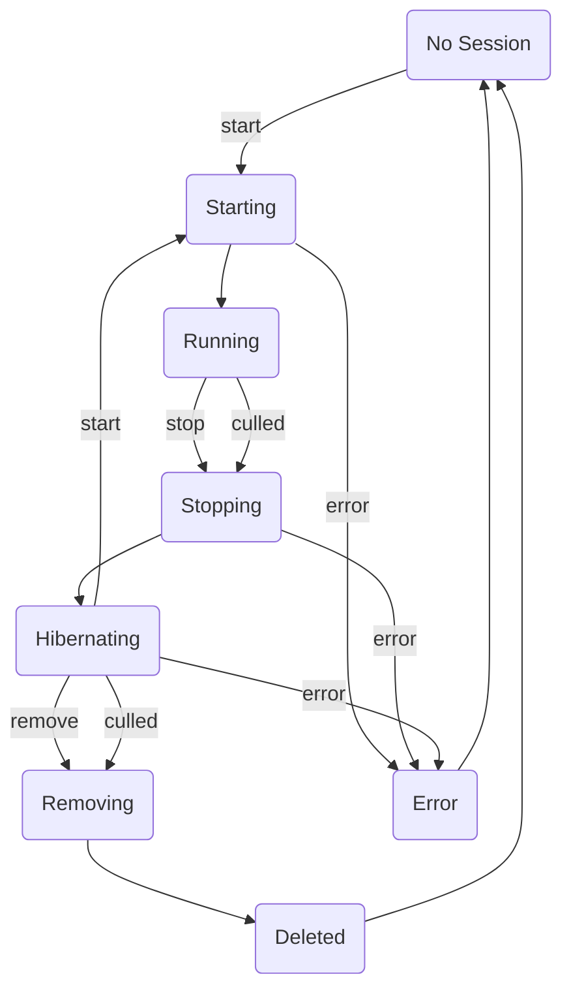
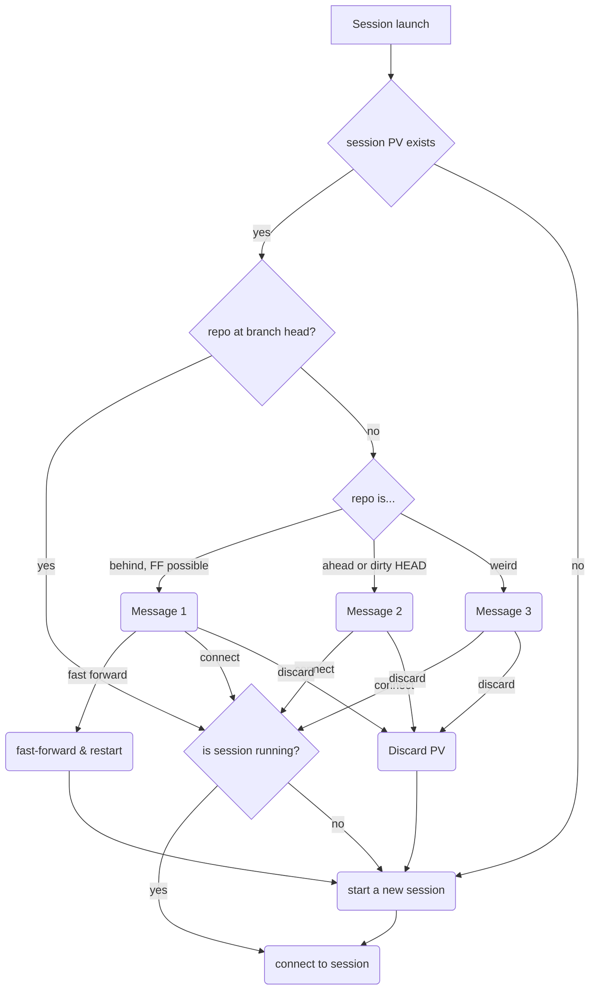

- Start Date: 2023.04.26
- Status: Proposed

# Improve Session Persistence

## Summary

The aim of this RFC is to clarify session start flow for users and give them full control over possible situations.
Moreover, we want to improve the way we persist unsaved changes in a session when shutting down.

## Problem Statement

The fundamental issue that this RFC is trying to address is to demystify what happens during session launch and to avoid
situations that users end up in the state of a project which they do not expect. Primarily, the confusion is caused by
us trying to do clever things with data which had been preserved when a session was closed, i.e. the notorious
*autosave*. We use git to create autosave branches to persist unsaved changes/data in a session. Many things can go
wrong by using git which makes this approach unreliable in addition to be confusing.

### Launching a Session

We support two different flows of launching sessions in Renku: *Quickstart* and *Options*. The *Quickstart* flow is when
users click on the **Play** button in a project. The *Options* flow is when users click on the **New session** button in
the project's *Sessions* tab which then shows a list of options to start a session.

What happens during the *Quickstart* flow is completely opaque to users. Based on project's state we do one of the
following three actions to launch a session:
1. If there is a running session on the same branch, we redirect there directly
2. If there is an autosave, we launch from there
3. If the previous two do not exist, we start a session from the tip of the main branch

We don’t notify the users about this order of preference steps, and we don’t tell them what exactly the decision was.
This has been specially problematic with autosave branches because the content of those branches can be very different
from what users expect (e.g. missing libraries that they have since installed), leaving them in a state completely
different from what they expected.

### Autosave Branches

When users close a session without committing or pushing changes, we create a branch to commit unsaved changes. This
*autosave* branch is then pushed to project's remote to be restored next time a session is launched. There are many
issues with this approach of persisting session's state:

- If the user has a lot of unsaved data we create a large autosave branch and have to make assumptions about what should
  or should not go to LFS.

- When we recover the autosave branches, we have to reset/undo some of the commits we added to create the autosave to
  make the state look like exactly how the users left it. If we have to put things in LFS then undoing these changes can
  be finicky or take more time. Currently, we do not do it.

- If for some reason large files are not piped to LFS when we create autosaves, we risk essentially making a user's repo
  unusable by committing and pushing large files.

- If a session crashes in a weird way, the step that creates the autosave branch can fail or be interrupted and the data
  is lost.

- If the autosave creation takes too long (i.e. the user has lots of data) it will be eventually interrupted and the
  data will be lost. We have a generous timeout for this but, it is not impossible.

- If the user launches a session from a newer commit than the root of the autosave branch then the autosave is deleted.

- We recognize autosave branches by naming them in a specific way (i.e. `renku/autosave/...`) in user's repository. A
  user can accidentally delete one of their autosave branches without realizing it.

- If users have sensitive data that they never intended to put in git but their session crashes, is culled, or they
  accidentally close it, then this data ends up in git. In a project that is public anyone will have access to this (and
  other users') autosave branches and their sensitive data. We have not really thought about this much before but, we
  could end up exposing sensitive user data like this. When we create the autosave we do respect the `.gitignore` file
  however, it could be that users have not yet edited this accordingly.

- We have to synchronize the shutdown order of our session containers. We need it because the `git-proxy` must shut down
  after the session so that the session’s autosave can be saved (i.e. push to the remote requires git credentials).
  Since Kubernetes doesn't have a native way to do this, the `git-proxy` has to listen on a specific endpoint to receive
  a request from the container that creates the autosave before it can shut down. We also have to extend the graceful
  shutdown period for the pod to allow for all of this to happen.

- … many more 😅

### Summary

The current implementation of *saving* work when a hosted user session shuts down leads to confusion in the best-, and
data loss in the worst-case scenarios. There is a need for a **workspace** in a project that users can come to where their
data and progress are reliably stored.

## Key Assumptions

- We assume that there is one session per project per user.

## Proposed solution

From the user's perspective, connecting to a session, quitting, and reconnecting again is like coming and going from a
**workspace** - they don't think about it in terms of the underlying git repository state, and we should not expect them
to. If the state of their current workspace (session volume) is different from what they asked for, they are presented
with options to make an informed and deliberate decision about how to proceed. A good template for the behavior we
should be going for is the UX of GitHub Codespaces.

### TL;DR of the Technical Proposal

1. Rely on Permanent Volumes for saving session state.
2. On session shutdown, transition the session pod to a minimal state with PV and helper containers to communicate
   about, and change the state of the repo on-disk.
3. On session launch, check if an existing PV for the project/user exists - if yes, compare the requested state with the
   state on disk and inform the user about a potential mismatch.

## Technical Details

We want to eliminate *autosave branches* as a way to store session state. This choice has some consequences:

- If sessions are to be resilient against failures of any kind, they *must* be using Permanent Volumes for session
  storage.

- To simplify PV management, we assume there is *one session per project per user*; we believe that if the user wants to
  compare different states of their project, they will simply use `git` inside the session for this. Note that this
  assumption may need to be revisited at a later point, but we think it's a good tradeoff given the rising complexity of
  managing sessions.

The basic idea then is to:

1. Rely on the PV mechanism to preserve user data; this has the benefit of being resilient to various timeouts and
   synchronization issues of autosave branches as well as eliminating unnecessary objects polluting LFS.
2. Inform clients about the state of the repository *inside the PV* and to manipulate it to match what the user wants. 
3. Present the user with simple choices when the requested session does not match the state inside the PV; allow users
   to take informed decisions when there is no obvious way forward

### Additional Technical Details

The main difference that we would introduce in Amalthea/Sessions is the following:

1. Sessions exist in one of 3 forms:
   - **Running**: This is the same as the current sessions
       - Containers: `oauth2-proxy`, `git-proxy`, `sidecar`, `session`
       - No changes from currently running sessions
   - **Hibernating**:
       - Storage is retained, but the user’s container is gone; the user’s data and code are retained, so we do not need
         to create autosave branches anymore.
       - The `sidecar` container is kept to provide information about the repository in the PV; it is used by the
         clients (UI) to query the state of the user repo (is the repo dirty, what commit it is on, what branch, etc.).
       - The `oauth2-proxy` container needs to stay for authenticating calls to the sidecar.
       - The `git-proxy` container needs to stay to inject credentials in calls the sidecar makes.
       - Users will see sessions in this **Hibernating** form. The main reason for this is that we must surface information
         about when the **Hibernating** form (and any of its data) will be removed. We should define what actions users will
         be able to do to these **Hibernating** sessions because they will differ from what is available to **Running** forms.
   - **Deleted**:
       - The **Hibernating** version is deleted after some period of not being used. The user should be somehow notified if
         there is unsaved data here that will be deleted.
         The UI could mark the sessions about to expire with a warning sign; this might be more effective once we have
         the dashboard in place because the sessions should be in a primary spot.
       - This culling interval is different from the culling interval for the **Running** sessions.

2. Shutting down a session (i.e. the user clicking the button in the UI to stop a session) results always in simply
   going to the **Hibernating** form. In the case that the PV state is fully synced in git, we could consider removing the PV;
   keeping it around means, however, that we can start the session quicker next time (e.g. the data is already fetched).

3. Culling active sessions turn them into **Hibernating** form. We can consider reducing the culling interval since part of
   the motivation for keeping it long is to avoid too many autosave branches.
 
4. Additional logic will cull the **Hibernating** forms with a separate (longer) culling interval.

The following diagram shows the transition between various session states:

### Launch Flow

With the proposed solution, the decision tree to launch a session is similar to what is depicted as follows. Note that
in all possible states, the user is informed about the current state and can make a clear decision on how to proceed
when needed.

`Message 1`, `Message 2`, and `Message 3` in the above diagram are displayed to the users when a decision should be
made. We possibly show a diff of the persisted state and the requested state to the user and ask them to choose one the
several possible paths to proceed to the launch. These messages along with possible followup paths are similar to the
following list:

- Message 1: You launched a session earlier on this project but the content seems older

  - `Fast forward to the latest version` picking the last commit on `<branch>`
  - `Connect to the existing session`
  - `Discard the changes` and pick the last commit on `<branch>`

- Message 2: You launched a session earlier on this project, and it contains new unsaved work

  - `Connect to the session` and continue from there
  - `Discard the changes` and pick the last commit on `<branch>`

- Message 3: You launched a session earlier on this project and the state has diverged from the remote repository

  - `Connect to the session` and continue from there
  - `Discard the changes` and pick the last commit on `<branch>`

### A Few Extra Details:

We need to prompt users with the possible session launch decisions in each of the possible launch flows. The following
list shows when we should ask for users' decision for each launch flow:

- *Quickstart*: The feedback should appear early in the first phase. With WebSockets in place, the UI should always
  know the up-to-date state of sessions, so we know if we need to show an early message.

- *Options*: We assume users might want to personalize resources or change branch/commit. Before allowing any change,
  the user should see the message and either `Connect to the sessions` or `Discard the changes` and then personalize the
  environment.

- *Sharable link with specific commits*: this is a variation of the *Quickstart* since the user might be running
  another session and be unaware that the sharable link would nuke it. I propose adding a node to the graph above after
  “session PV exists —> Yes” to check whether there is an embedded commit (and that’s different from the running
  session). In that case, we mention something like:
    - You have opened a session URL embedding a specific version of the application. Since you launched a session
      earlier on this project, those changes would go lost.
        - `Continue to the specific version` and lose the previous work
        - `Connect to your session` instead

- *Anonymous*: We don’t preserve any work for anonymous users, so is the PV exists then the session is also running.

## 🐰 Rabbit Holes

- Refactoring/rewriting stuff in Go?

  - We keep adding stuff to Amalthea but is this a reason to refactor to Golang? Should we try to do this ahead of the
    shape-up? For example, we see some instability with Amalthea when doing maintenance on nodes. Probably can get
    better performance and resource usage with Go.
  - Do we combine the `oauth2-proxy`, `git-proxy`, and `sidecar` in one thing? The `oauth2-proxy` is a separate
    ready-to-use image but the program is written in Go. The `git-proxy` is written in Go. Re-writing the `sidecar` in
    Go is worth it and doable.

- Using argo workflows instead of Amalthea for sessions. This is interesting, but it would mean too many changes all at
  once. We should not do it here. We are not even fully certain this is truly worth doing. Moreover, if we cannot do
  what we try to do here in Argo workflows then we should not use Argo workflows at all for running sessions.

- Sessions where the git project has been deleted.

- Do not implement automatic docker environment fast-forwarding here. Do another issue or a separate shape up.

- We don't want to implement a centralized authentication service for sessions here.

- Using this opportunity to refactoring the UI code around sessions seems good (and necessary to some extent, since we
  benefit from WebSockets) but that shouldn't slow down the backend development. The frontend person should plan the
  work accordingly.

- What should happen when user clicks the **Stop** button: Should we remove the session or hibernate it?

- Number of mounted volumes per node is limited (~24 volumes). We should avoid reaching this threshold.

## Nice to Have

- To notify users about deleting unsaved data (i.e. **Hibernating** sessions) that is unused for a while, an ideal solution
  would be to email them for example 3 days and again 1 day in advance.This requires more pieces in the infrastructure.

- Show a diff of the persisted session and the requested session (by the user) when asking the user to make decisions
  during session launch.

- We should reflect the correct state from the backend on the UI to show proper feedback to the users. State of a
  sessions can be **Running** (i.e. running), **Hibernating**, **Starting**, **Stopping**, and **Error**.

- When launching from a **Hibernating** session, we should check that the environment doesn't differ between the **Hibernating**
  session and the requested version. This can be done by checking relevant files for the environment configuration. If
  there is a difference, we should warn the user to either restore the session or start a new one.

- We should use some tiny nodes to store hibernated session to reduce the cost.

- We can remove the `oauth2-proxy`, `git-proxy`, and `sidecar` container in the **Hibernating** mode by storing some
  metadata about the session. We can then bring them up on-demand if we need to do some operations on the PV. We can
  store the PV in some cheaper storage (e.g. S3).

- A **Pause** button in the UI to hibernate the session.
