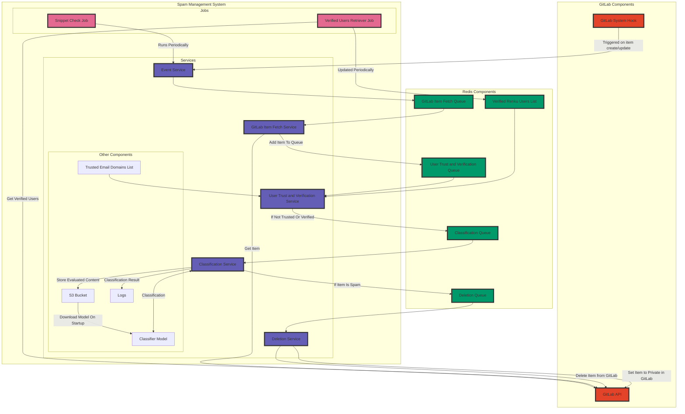
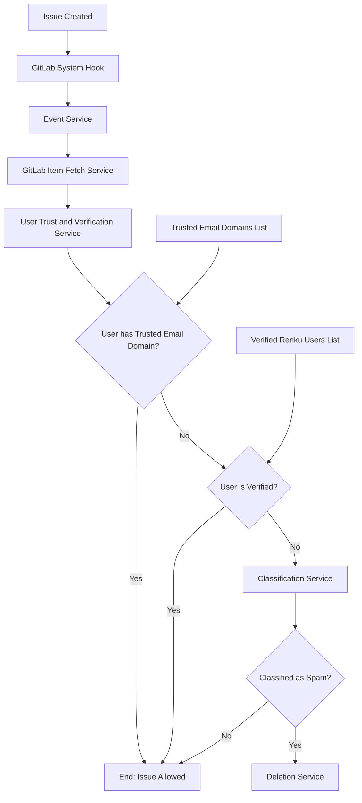
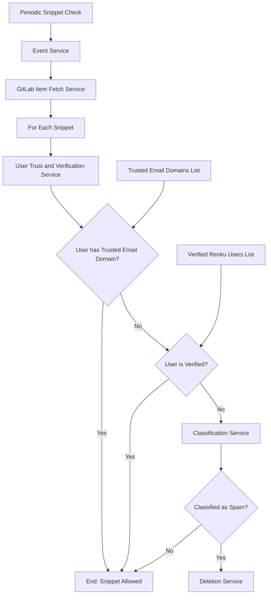

# Implementing a Spam Management Service for GitLab

- Start Date: 2023-05-19
- Status: Proposed

## Summary

This proposal aims to introduce a spam management service to mitigate spam on GitLab and improve user experience and security. This service will use machine learning models to detect and eliminate spam across the platform in real-time where possible, focusing on snippets, issues, notes, projects, and user profiles.

## Problem Statement

GitLab, a service on which RenkuLab relies, is not immune to the issue of spam. Spam can infiltrate various platform aspects, including snippets, issues, notes, projects, and user profiles. Spam disrupts the user experience, poses potential security risks, and damages the reputation and RenkuLab.io's SEO. GitLab lacks a robust, real-time solution to identify and eliminate spam across all attack vectors.

## Key Assumptions

- The proposed machine learning model will be built in consultation with the innovation team. The machine learning model's specifics are out of this RFC's scope.

## Possible Solutions

- A service that only checks for spam at regular intervals. This solution is less than ideal because of the delay between the spam being posted and the spam being detected and removed, during which spam could already be harmful. 

- Monitor GitLab for spam manually. This solution is unsuitable because it is time-consuming.

- GitLab has its [Spamcheck](https://docs.gitlab.com/ee/user/admin_area/reporting/spamcheck.html) service, which can be used to check for spam issues and snippets. This service does not check for spam in notes, projects, or user profiles. Currently, it is not possible to configure the service to delete spam automatically. Deploying GitLab's Spamcheck service also requires GitLab Enterprise Edition, which RenkuLab.io's GitLab is not currently running on.

- GitLab can make use of [Akismet](https://akismet.com/), a third-party-hosted AI spam filter. However, this only checks for spam on issues and notes, needs training, and would involve handing data over to a third party in the US.

## Proposed Solution

The proposed spam management service will integrate with GitLab via system hooks and regularly scheduled jobs. When notes, projects, or users are created or updated, GitLab will send system hooks to a spam management service. System hooks request examples can be found [here](https://docs.gitlab.com/ee/administration/system_hooks.html#hooks-request-example).

System hooks triggered on group, project, and user events can be triggered at the system level. Issues and comments at a project level would require a project-level system hook. This could be configured when a project is added to KG, or KG could forward project-level events to the spam management service's event service. Project-level webhook events examples can be found [here](https://docs.gitlab.com/ee/user/project/integrations/webhook_events.html).

Snippets do not have system hooks. Therefore a job triggered at regular intervals will be required to check for new snippets. This can be done by checking the snippet API for new snippets. Documentation on the snippet API can be found [here](https://docs.gitlab.com/ee/api/snippets.html).

Ideally, the solution will also be able to check abuse reports manually submitted by users in GitLab and check the reported URL in the abuse report for spam content.

A feedback mechanism would also be implemented, allowing the machine learning model to learn from mistakes and improve over time. This could be done by storing content in an S3 bucket and regularly re-training the model on a dataset including new data. The system should also keep a log of decisions made and the confidence level of the decision, as well as export Prometheus metrics which can be used to compile regular reports.

Similarly to GitLab's Spamcheck service, storing the model in an S3 bucket and pulling it to the spam management service on start-up would allow the model to be updated without having to redeploy the spam management service.

An allowlist of trusted email domains could be implemented to prevent false positives and ensure users with trusted email domains can post content without being checked for spam. YAT already possesses a list of trusted email domains. Users without trusted email domains could also be verified with a 'verified' string in the GitLab user's admin note. A list of verified users would be stored in Redis and updated periodically. This would allow users to be verified without having to redeploy the spam management service.

A queue management system such as [Redis lists](https://redis.io/docs/data-types/lists/) would be used to track items that need to be classified and spam items that need to be deleted from GitLab. This helps to ensure the system can handle many system hooks from GitLab without significant latency and without overloading the GitLab API. Redis was chosen because of GitLab's existing reliance on Redis; and not wanting to add another dependency to the system, which should be able to work independently of RenkuLab. Depending on the amount of data sent to the service and its efficiency, it may be necessary to implement Redis persistence in the case of a crash.

This mermaid diagram provides an overview of how this system would work:

Decision tree for when an issue is created on GitLab:

Decision tree for periodic snippet checking:

## Drawbacks

1. Ensuring the system can handle many system hooks from GitLab without significant latency is critical. It needs to be scalable and able to handle peak loads.
2. The spam management service will require a GitLab personal access token with administrative rights to delete spam.
3. We must ensure we can be informed of and restore incorrectly classified content.

## Rationale and Alternatives

This solution is deemed the best as it provides real-time spam detection without intruding on the user experience. Alternatives such as manual monitoring are too time-consuming.

Not implementing this solution would mean continuing to expose GitLab users to potential spam, which could disrupt their experience and pose security risks, and open RenkuLab.io up to promoting unethical content.

## Unresolved Questions

- How will user privacy be protected? Storing datasets with legitimate content in an S3 bucket might be unsafe.
- How and when will users be notified if their content is identified as spam and removed?
